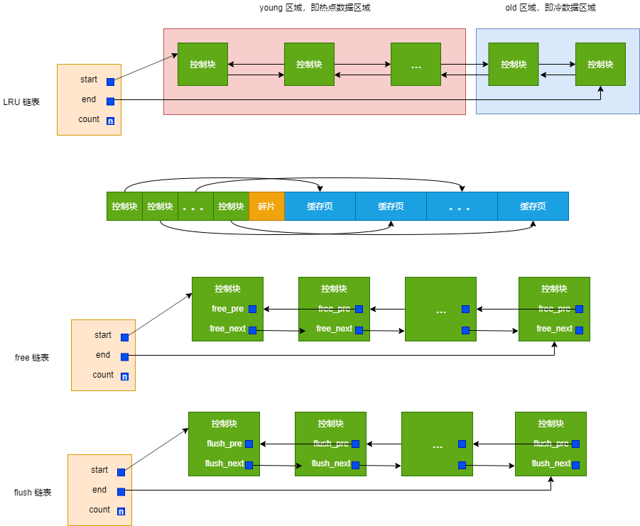

# Buffer Pool

### Buffer Pool 组成结构

* **控制块**：包括表空间编号、页号、缓存页在 `Buffer Pool` 中的地址、链表节点信息、锁信息等控制信息
* **缓存页**：访问某个页的数据时，需要将数据页加载到 `Buffer Pool` 中，访问后不会立刻释放，所以叫缓存页
* **free 链表**：记录 `Buffer Pool` 中哪些缓存页是可用的。当加载一个页到 `Buffer Pool` 时，删除 free 链表对应节点
* **flush 链表**：记录哪些是脏页，即被修改过的
* **LRU 链表**：当 Buffer Pool 内存不够时，采用 LRU 淘汰页面
  * **young 区**：热点数据。当两次访问时间超过一定间隔时，将缓存页添加到移动到 `young` 区头部，防止全表扫描造成的命中率下降。
  * **old 区**：冷数据。初次加载数据页时，放在 `old` 区头部，防止预读造成的命中率降低

> 根据触发方式不同，预读分为线性预读和随机预读两种
>
>  线性预读：如果顺序访问了某个区\(extent\) 的页面超过一定值，将下一个区中全部页面异步读取到 Buffer Pool
>
>  随机预读：如果 Buffer Pool 已经缓存了某个区 13 个连续页面，本区中剩余页面异步读取到 Buffer Pool


MySQL 5.7.5 之后支持在服务器运行过程中调整 Buffer Pool 大小，为了防止重新调整 Buffer Pool 大小带来的性能消耗，MySQL 以 chunk 为单位向操作系统申请空间。也就是说一个 Buffer Pool 实例由若干个 chunk 组成，一个 chunk 代表一块连续的内存空间，里面包含了若干缓存页与其对应的控制块。


### 刷新脏页到磁盘

后台有专门的线程每隔一段时间负责将脏页刷新到磁盘

* `BUF_FLUSH_LRU`：定时从 LRU 链表尾部扫描一些页面，发现脏页就刷新到磁盘
* `BUF_FLUSH_LIST`：定时从 flush 链表中刷新一部分页面到磁盘，刷新速度取决于系统的繁忙程度

 当 Buffer Pool 内存空间不足时，会从 LRU 链表尾部释放掉未修改页面。如果没有未修改页面，就将 LRU 链表尾部地一个脏页刷新到磁盘中。这种刷新单个页面到磁盘中的刷新方式称之为 `BUF_FLUSH_SINGLE_PAGE`。

### change buffer

当需要更新一个数据页时，如果数据页在内存中就直接更新；如果不在内存中，在不影响数据一致性的前提下，InnoDB 会将这些更新操作缓存在 change buffer 中。在下次查询需要访问这个数据页的时候，将数据页读入内存，然后执行 change buffer 中与这个页有关的操作。

change buffer 适用于写多读少的场景，特别是页面在写完以后马上被访问的概率比较少的场景。


change buffer 使用的是 buffer pool 中的内存。

只有普通索引才能使用 change buffer


