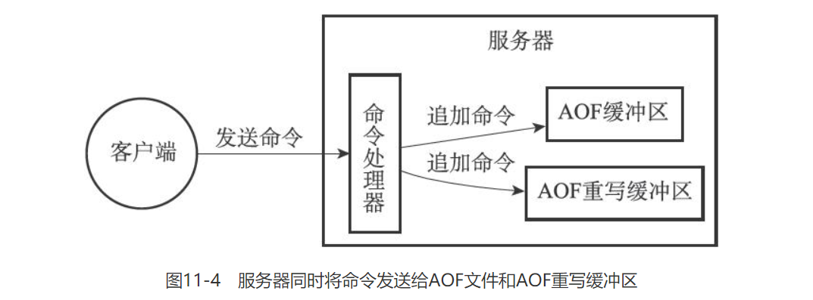

# 持久化

Redis 有两种持久化方式，分别是 RDB 和 AOF

## RDB

### RDB 触发机制

有三种触发 RDB 的方法，分别是

* `SAVE` 同步命令：`SAVE` 命令回阻塞 Redis 服务器进程，直到 RDB 文件创建完毕为止。这时客户端发送的所有命令都会被阻塞
* `BGSAVE` 异步命令：`BGSAVE` 命令回 `fork` 出一个进程用于创建 RDB  文件
* 自动触发：在配置文件中配置，比如 `save 60 10000`，当满足这个条件时，会使用 `BGSAVE` 生成 RDB 文件

需要注意的是，在 `BGSAVE` 命令执行期间，如果客户端发送 `SAVE` 、`BGSAVE` 命令都会被拒绝。因为这两个命令最终都会调用 `rdbSave` 方法，如果同时执行会产生竞争条件。

对于自动保存生成 RDB 文件的方式，Redis 会设置服务器状态 redisServer 结构的 saveparams 属性

```c
struct redisServer {
    // ...
    struct saveparam *saveparams; // 记录保存条件的数组
    //...
    long long dirty; // 记录距上次执行 SAVE/BGSAVE 后，服务器对数据库状态做了多少次修改
    time_t lastsave; // 记录上次保存的时间戳
}
```

Redis 会周期性地操作函数 `serverCron`，检查 `save` 选项所设置地保存条件是否已经满足（默认每个 100ms 执行依次）。 程序会遍历并检查 `saveparams` 数组中的所有保存条件，只要有一个条件满足，就会执行 `BGSAVE` 命令。

### RDB 文件结构

* REDIS：保存 "REDIS" 5 个字符，用于快速检测所载入的文件是否是 RDB 文件，占用 5 字节
* `db_version`：记录 RDB 文件的版本号，如 "0006" 代表第六版，占用 4 字节
* `databases`：包含任意个数据库，长度随数据库的键值对变化
  * `SELETCDB`：标识接下来要读入的时一个数据库号码
  * `db_number`：数据库号码
  * `key_value_pairs`：保存对应数据库中所有的键值对
    * `TYPE`：记录了 `value` 的类型
    * `key`：键值对的键，是一个 `REDIS_RDB_TYPE_STRING` 类型的字符串对象
    * `value`：保存的值
    * `EXPIRETIME_MS`：标识接下来要读取的是国企时间，单位为毫秒。占用 1 字节
    * `ms`：过期时间的时间戳形式
* `EOF`：标志 RDB 文件正文内容的结束。占用 1 字节
* `check_sum`：通过对 REDIS、db\_version、databases、EOF 四部分的内容计算得出。在载入 RDB 文件时会通过 check\_sum 和计算得出的值进行对比，以此来检查 RDB 文件是否出错或损坏

## AOF

### AOF 持久化的实现

 AOF 持久化功能的实现可以分为三个步骤：命令追加\(append\)、文件写入、文件同步\(sync\)

* **命令追加**：服务器在执行完一个命令后，将被执行的写命令追加到服务器状态的 `aof_buf` 缓冲区的末尾。
* 文件写入与同步：服务器在每次结束一个事件循环之前，调用 `flushAppendOnlyFile` 函数，将缓冲区中的内容写入和保存到 AOF 文件中。

 `flushAppendOnlyFile` 的行为由配置文件中的 `appendfsync` 选项来决定。如果没有设置，默认为 everysec。

| appendfsync 选项 | flushAppendOnlyFile 函数行为 |
| :---: | :---: |
| always | 对于每个写命令都写入并同步到 AOF 文件 |
| everysec | 每秒将缓冲区中的内容同步到 AOF 文件 |
| no | 让操作系统决定合适进行同步 |

* always：效率低，安全性高
* everysec：保证系统最多只会丢失 1 秒的数据
* no：写入快，同步时间长，安全性低

### AOF 重写

 由于 AOF 是通过保存写命令来记录数据库状态的，所以时间的流逝，AOF 文件体积会变得很大，还原的时间就越多。AOF 重写就是为了解决 AOF 文件体积膨胀而提出来的。

 AOF 重写并不会对现有的 AOF 文件进行读取、分析或者写入操作，它会先从数据库中读取键的值，然后用一条命令去记录键值对，代替之前记录这个键值对的多条命令。如果一个键对应值的数量超过了 `REDIS_AOF_REWRITE_ITEMS_PER_CMD` ，就会有用多条命令来记录，每条命令设置的元素数量为 `REDIS_AOF_REWRITE_ITEMS_PER_CMD` 个。

 Redis 将 AOF 重写程序放在子进程中执行，这样可以达到两个目的：

* 子进程进行 AOF 重写期间，服务器进程可以继续处理命令请求
* 子进程带有服务器进程的副本，可以在不使用锁的情况下保证数据的安全

 将 AOF 重写程序放在子进程中执行会丢失重写过程中对数据库的修改，造成当前数据库状态和重写 AOF 文件保存的数据库状态不一致的问题。为了解决这个问题，Redis 服务器设置了一个 AOF 重写缓冲区，当服务器执行完一个命令后，会写命令发送给 AOF 缓冲区和 AOF 重写缓冲区。在 AOF 重写进程完成工作后，会发送一个信号，父进程接收到信号后会将 AOF 重写缓冲区中的内容写入到新 AOF 中，然后覆盖现有 AOF。这个过程会阻塞父进程。



## 

## 参考资料

