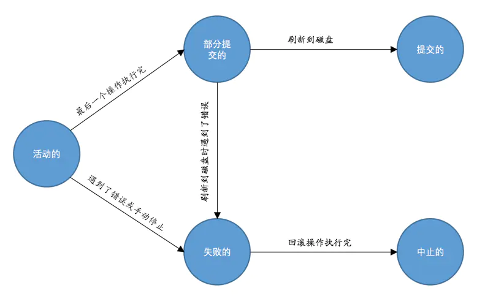

# 事务

事务是指满足 原子性\(Atomicity\)、一致性\(Consistency\)、隔离性\(Isolation\)、持久性\(Durability\) 的一个或多个数据库操作。

事务的状态：

* `活动的(active)`：事务对应的数据库操作正在执行过程中
* `部分提交的(partially committed)`：当事务中的最后一个事务执行完成，但由于操作都在内存中执行，所造成的影响并没有刷新到磁盘时，事务处在 部分提交状态。
* `失败的(failed)`：当事务在 `活动的` 或 `部分提交的` 状态时，遇到错误而无法继续执行。
* `中止的(aborted)`：事务执行了一半而变为失败状态（回滚操作完毕时）
* `提交的(committed)`：一个处在 `部分提交` 状态的事务将修改过的数据同步到磁盘上之后的状态。

### 事务的特性

* **原子性\(Atomicity\)**：事务中所有操作都是不可分割的整体，要么全部成功，要么全部失败
* **一致性\(Consistency\)**：不论是正常执行还是异常退出，事务执行前后都要保证数据的完整性
* **隔离性\(Isolation\)**：并发操作中，不同事务的相互隔离，不会相互影响
* **持久性\(Durability\)**：事务操作完成后数据会被持久化到永久存储中

