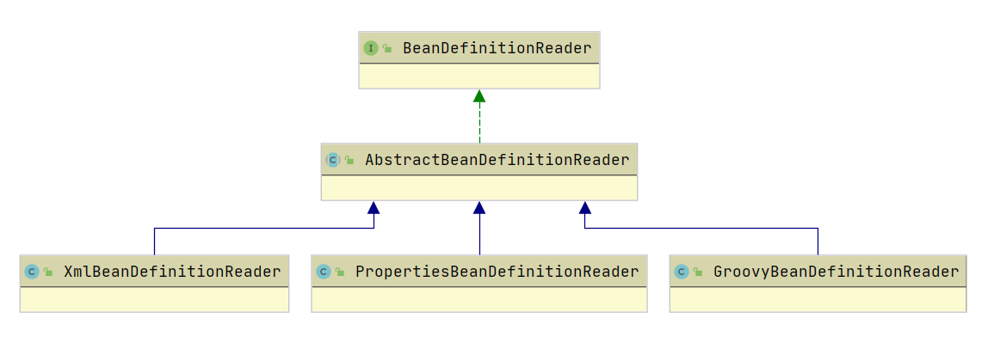

# BeanDefinitionReader

`BeanDefinitionReader` 的作用是读取 Spring 配置文件，并利用 `ResourceLoader` 或 `ResourceResolver` 将其转换为 IOC 容器内部的数据结构 `BeanDefinition`。最后会借助 `BeanDefinitionRegistry` 将 `BeanDefinition`注册到容器中。

`BeanDefinitionReader` 的继承体系：



`BeanDefinitionReader` 定义了一系列对加载资源的方法。

```java
public interface BeanDefinitionReader {

    // 获取 BeanDefinitionRegistry 对象，这个类的主要作用是将 BeanDefinition 注册到注册表中
    BeanDefinitionRegistry getRegistry();

    // 返回 资源加载器，用于加载资源
    @Nullable
    ResourceLoader getResourceLoader();

    // 返回用于 Bean的类加载器
    @Nullable
    ClassLoader getBeanClassLoader();

    // 生成 Bean 的名字
    BeanNameGenerator getBeanNameGenerator();

    // 加载单个配置文件
    int loadBeanDefinitions(Resource resource) throws BeanDefinitionStoreException;

    // 加载多个配置文件，解析为 BeanDefinition
    int loadBeanDefinitions(Resource... resources) throws BeanDefinitionStoreException;

    // 加载单个配置文件
    int loadBeanDefinitions(String location) throws BeanDefinitionStoreException;

    // 加载多个配置文件
    int loadBeanDefinitions(String... locations) throws BeanDefinitionStoreException;

}
```

## AbstractBeanDefinitionReader

`AbstractBeanDefinitionReader` 实现了 `BeanDefinitionReader` 接口，提供了公共的处理逻辑。其最核心的方法是 `loadBeanDefinition` 方法。Spring 就是调用这个方法来将配置文件转换为 `BeanDefinition` 的。

```java
public int loadBeanDefinitions(String location, @Nullable Set<Resource> actualResources) throws BeanDefinitionStoreException {
    //获取资源加载类，主要的作用就是根据路径和类加载器获取 Resource 对象
    ResourceLoader resourceLoader = getResourceLoader();
    if (resourceLoader == null) {/*抛BeanDefinitionStoreException*/}

    // ResourcePatternResolver 用于加载 多个文件 或者能够加载 Ant 风格路径的文件资源
    if (resourceLoader instanceof ResourcePatternResolver) {
        try {
            // 获取资源
            Resource[] resources = ((ResourcePatternResolver) resourceLoader).getResources(location);
            int count = loadBeanDefinitions(resources);
            if (actualResources != null) {
                Collections.addAll(actualResources, resources);
            }
            return count;
        }
        catch (IOException ex) {}
    }
    else {
        // 默认的 ResourceLoader 实例，加载单个文件资源
        // Can only load single resources by absolute URL.
        Resource resource = resourceLoader.getResource(location);
        int count = loadBeanDefinitions(resource);
        if (actualResources != null) {
            actualResources.add(resource);
        }
        return count;
    }
}
```

在 `loadBeanDefinition` 方法中通过 调用 `getResource` 方法来获取资源。而 `getResource` 方法利用内部的成员遍历 `resourcePatternResolver`，通过 `ResourcePatternResolver` 来得到资源。`ResourcePatternResolver` 继承了 `BeanDefinitionLoader`，可以根据资源类型，自动获取到资源。

```java
public Resource[] getResources(String locationPattern) throws IOException {
    return this.resourcePatternResolver.getResources(locationPattern);
}
```

获取到资源后会调用处理多个资源的 `loadBeanDefinitions` 方法。该方法的处理逻辑就是遍历资源列表，分别调用加载单个资源的方法。

```java
public int loadBeanDefinitions(Resource... resources) throws BeanDefinitionStoreException {
    Assert.notNull(resources, "Resource array must not be null");
    int count = 0;
    for (Resource resource : resources) {
        count += loadBeanDefinitions(resource);
    }
    return count;
}
```

如果是使用 xml 的方式来启动配置的话，会调用 `XmlBeanDefinitionRead` 的 `loadBeanDefinitions` 方法。

```java
public int loadBeanDefinitions(Resource resource) throws BeanDefinitionStoreException {
    return loadBeanDefinitions(new EncodedResource(resource));
}
```

## XmlBeanDefinitionReader

该类是 `AbstractBeanDefinitionReader` 的扩展子类，主要用于读取 XML 文件。

```java
public int loadBeanDefinitions(EncodedResource encodedResource) throws BeanDefinitionStoreException {
    Set<EncodedResource> currentResources = this.resourcesCurrentlyBeingLoaded.get();
    // 如果本地线程变量中不存在正在加载的资源，那么将其添加进去
    if (currentResources == null) {
        currentResources = new HashSet<>(4);
        this.resourcesCurrentlyBeingLoaded.set(currentResources);
    }
    // 如果添加 encodedResource 失败，说明已经存在这个资源，只是还没加载完成
    if (!currentResources.add(encodedResource)) {/*BeanDefinitionStoreException*/}
    try {
        InputStream inputStream = encodedResource.getResource().getInputStream();
        try {
            InputSource inputSource = new InputSource(inputStream);
            if (encodedResource.getEncoding() != null) {
                inputSource.setEncoding(encodedResource.getEncoding());
            }
            // 解析
            return doLoadBeanDefinitions(inputSource, encodedResource.getResource());
        }
        finally {inputStream.close();}
    }
    catch (IOException ex) {}
    finally {
        currentResources.remove(encodedResource);
        if (currentResources.isEmpty()) {
            this.resourcesCurrentlyBeingLoaded.remove();
        }
    }
}
```

真正用于读取 XML 文件的是 `doLoadBeanDefinitions` 方法。这个方法主要做了两件事情：

* 获取 DOM 树
* 解析 DOM 树，并向容器中注册 `BeanDefinition`

```java
protected int doLoadBeanDefinitions(InputSource inputSource, Resource resource)
    throws BeanDefinitionStoreException {

    try {
        Document doc = doLoadDocument(inputSource, resource);
        // 解析 dom 树，保存到 BeanDefinition 中，并向容器中注册 BeanDefinition
        int count = registerBeanDefinitions(doc, resource);
        return count;
    }
    catch () {}
}
```

**获取 DOM树**

```java
protected Document doLoadDocument(InputSource inputSource, Resource resource) throws Exception {
    // getValidationModeForResource：确定使用 xsd 还是 dtd
    return this.documentLoader.loadDocument(inputSource, getEntityResolver(), this.errorHandler,
            getValidationModeForResource(resource), isNamespaceAware());
}
```

```java
public Document loadDocument(InputSource inputSource, EntityResolver entityResolver,
        ErrorHandler errorHandler, int validationMode, boolean namespaceAware) throws Exception {

    DocumentBuilderFactory factory = createDocumentBuilderFactory(validationMode, namespaceAware);
    DocumentBuilder builder = createDocumentBuilder(factory, entityResolver, errorHandler);
    return builder.parse(inputSource);
}
```

**解析 DOM 树**

```java
public int registerBeanDefinitions(Document doc, Resource resource) throws BeanDefinitionStoreException {
    // 创建 BeanDefinitionReader，从 dom 树中读取 BeanDefinition
    BeanDefinitionDocumentReader documentReader = createBeanDefinitionDocumentReader();
    // 获取注册表 beanDefinitionMap 在本次加载前的 BeanDefinition 数量
    int countBefore = getRegistry().getBeanDefinitionCount();
    // 加载并注册
    documentReader.registerBeanDefinitions(doc, createReaderContext(resource));
    // 本次加载后容器里 BeanDefinition 的数量减去先前的，即本次加载的 BeanDefinitino 数量
    return getRegistry().getBeanDefinitionCount() - countBefore;
}
```

`registerBeanDefinitions` 方法返回的是本次注册的 `BeanDefinition` 的数量。其实现方法是在注册之前获取容器中 `BeanDefinition` 的数量，注册之后再获取一遍数量，最后返回其差值。

```java
public int getBeanDefinitionCount() {
       // beanDefinitionMap 是一个 ConcurrentHashMap<String, BeanDefinition>
    return this.beanDefinitionMap.size();
}
```

接下来看一下注册逻辑

```java
public void registerBeanDefinitions(Document doc, XmlReaderContext readerContext) {
    this.readerContext = readerContext;
    doRegisterBeanDefinitions(doc.getDocumentElement());
}

protected void doRegisterBeanDefinitions(Element root) {
    // BeanDefinition 解析委托类，用来解析 Document 对象
    BeanDefinitionParserDelegate parent = this.delegate;
    this.delegate = createDelegate(getReaderContext(), root, parent);
    // 检测是否符合 spring 规范
    //"http://www.springframework.org/schema/beans"
    if (this.delegate.isDefaultNamespace(root)) {
        // PROFILE_ATTRIBUTE = "profile"
        // 获取 profile 属性的值，表示剖面，用于设置环境（区分线下/线上环境）
        String profileSpec = root.getAttribute(PROFILE_ATTRIBUTE);
        if (StringUtils.hasText(profileSpec)) {
            // 以 "," ";" 分割
            String[] specifiedProfiles = StringUtils.tokenizeToStringArray(
                profileSpec, BeanDefinitionParserDelegate.MULTI_VALUE_ATTRIBUTE_DELIMITERS);
            // 判断这个切面是否是激活的环境，如果不是直接返回，表示这个配置文件不是当前环境的配置文件
            if (!getReaderContext().getEnvironment().acceptsProfiles(specifiedProfiles)) {
                return;
            }
        }
    }
    // preProcessXml postProcessXml 都是钩子方法
    preProcessXml(root);
    parseBeanDefinitions(root, this.delegate);
    postProcessXml(root);
    this.delegate = parent;
}
```

`parseBeanDefinitions` 方法是主要的解析方法，它会根据命名空间来进行不同的解析

```java
protected void parseBeanDefinitions(Element root, BeanDefinitionParserDelegate delegate) {
    // 如果是默认的名命空间
    if (delegate.isDefaultNamespace(root)) {
        // 获取根节点下的所有子节点，并遍历所有子节点
        NodeList nl = root.getChildNodes();
        for (int i = 0; i < nl.getLength(); i++) {
            Node node = nl.item(i);
            if (node instanceof Element) {
                Element ele = (Element) node;
                if (delegate.isDefaultNamespace(ele)) {
                    // 按照 spring 原有逻辑进行解析
                    parseDefaultElement(ele, delegate);
                }
                else {
                    // 否则使用扩展的自定义代理类进行解析
                    delegate.parseCustomElement(ele);
                }
            }
        }
    }
    else {
        // 使用扩展的自定义代理类进行解析
        delegate.parseCustomElement(root);
    }
}
```

默认命名空间解析使用的是 Spring 原有的逻辑进行解析的，而非默认的命名空间是交给 delegate 处理的

```java
private void parseDefaultElement(Element ele, BeanDefinitionParserDelegate delegate) {
    // 如果元素节点是 <import> 导入元素，进行导入解析
    if (delegate.nodeNameEquals(ele, IMPORT_ELEMENT)) {
        importBeanDefinitionResource(ele);
    }
    // 如果元素节点是 <Alias> 别名元素，进行别名解析
    else if (delegate.nodeNameEquals(ele, ALIAS_ELEMENT)) {
        processAliasRegistration(ele);
    }
    // 普通 <bean> 元素，按照 Spring 的 Bean 规则解析
    else if (delegate.nodeNameEquals(ele, BEAN_ELEMENT)) {
        processBeanDefinition(ele, delegate);
    }
    // 如果是 <beans> 元素，注册
    else if (delegate.nodeNameEquals(ele, NESTED_BEANS_ELEMENT)) {
        // recurse
        doRegisterBeanDefinitions(ele);
    }
}
```

`parseDefaultElement` 函数分别对 import、Alias、bean、beans 标签进行了解析，这里值讲述解析 bean 标签的方法。

```java
protected void processBeanDefinition(Element ele, BeanDefinitionParserDelegate delegate) {
    //BeanDefinitionHolder 是对 BeanDefinition 的封装，即 Bean 定义的封装类
    // 对 Document 对象中 <bean> 元素的解析由 BeanDefinitionParserDelegate 实现
    BeanDefinitionHolder bdHolder = delegate.parseBeanDefinitionElement(ele);
    if (bdHolder != null) {
        bdHolder = delegate.decorateBeanDefinitionIfRequired(ele, bdHolder);
        try {
            // Register the final decorated instance.
            // 向 IOC 容器注册解析得到的 BeanDefinition，是BeanDefinition向 IOC 容器注册的入口
            BeanDefinitionReaderUtils.registerBeanDefinition(bdHolder, getReaderContext().getRegistry());
        }
        catch (BeanDefinitionStoreException ex) {}
        // Send registration event.
        getReaderContext().fireComponentRegistered(new BeanComponentDefinition(bdHolder));
    }
}
```

`processBeanDefinition` 中对 bean 标签的解析交给了 `BeanDefinitionParserDelegate`，并返回一个包装后的 `BeanDefinition`—— `BeanDefinitionHolder`

```java
public BeanDefinitionHolder parseBeanDefinitionElement(Element ele) {
    return parseBeanDefinitionElement(ele, null);
}

public BeanDefinitionHolder parseBeanDefinitionElement(Element ele, @Nullable BeanDefinition containingBean) {
    // 获取 id、name 属性，并将 name 以 "," 分割，加入别名列表......
    String beanName = id;
    if (!StringUtils.hasText(beanName) && !aliases.isEmpty()) {
        // 如果没有指定 id，则将别名列表的第一个元素作为 id
        beanName = aliases.remove(0);
    }
    if (containingBean == null) { // 检验 id 是否重复
        checkNameUniqueness(beanName, aliases, ele);
    }
    // 创建一个 GenericBeanDefinition
    AbstractBeanDefinition beanDefinition = parseBeanDefinitionElement(ele, beanName, containingBean);
    if (beanDefinition != null) {
                    // 如果 name 和 id 都没有指定，生成一个 id
                    beanName = this.readerContext.generateBeanName(beanDefinition);
                    String beanClassName = beanDefinition.getBeanClassName();
            }
        }
        String[] aliasesArray = StringUtils.toStringArray(aliases);
        return new BeanDefinitionHolder(beanDefinition, beanName, aliasesArray);
    }
    return null;
}
```

代码前面获取了 bean 标签中的 id、name 属性，然后创建了一个 `GenericBeanDefinition` 对象。创建 `GenericBeanDefinition` 对象是通过 `BeanDefinitionParseDelegate#parseBeanDefinitionElement` 实现的。

```java
public AbstractBeanDefinition parseBeanDefinitionElement(
    Element ele, String beanName, @Nullable BeanDefinition containingBean) {
    this.parseState.push(new BeanEntry(beanName));
    // 获取 class 和 parent 属性......
    try {
        // 根据 class 和 parent 构建 BeanDefinition
        AbstractBeanDefinition bd = createBeanDefinition(className, parent);
        // 设置 其他属性(description、meta等)......
        return bd;
    }
    //catch () {}
    finally {
        this.parseState.pop();
    }
    return null;
}
```

`parseBeanDefinitionElement` 方法首先是获取了 class、parent 属性，然后根据 class 和 parent 构建出 `BeanDefinition` 对象，让其继承父 bean 的属性。构建 `BeanDefinition` 是通过 `BeanDefinitionReadUtils.createBeanDefinition` 实现的。

```java
public static AbstractBeanDefinition createBeanDefinition(
    @Nullable String parentName, @Nullable String className, @Nullable ClassLoader classLoader) throws ClassNotFoundException {

    GenericBeanDefinition bd = new GenericBeanDefinition();
    bd.setParentName(parentName);
    if (className != null) {
        if (classLoader != null) {
            bd.setBeanClass(ClassUtils.forName(className, classLoader));
        }
        else {
            bd.setBeanClassName(className);
        }
    }
    return bd;
}
```

可以看到创建 `BeanDefinition` 是使用 `GenericBeanDefinition` 来构建的。

构建了 `BeanDefinition` 后，就会将其注册到容器中。注册到容器中是通过 `BeanDefinitionReaderUtils#registerBeanDefinition` 实现的。

```java
public static void registerBeanDefinition(
    BeanDefinitionHolder definitionHolder, BeanDefinitionRegistry registry)
    throws BeanDefinitionStoreException {

    // Register bean definition under primary name.
    // 将 beandefinition 及其名字注册到容器中
    String beanName = definitionHolder.getBeanName();
    registry.registerBeanDefinition(beanName, definitionHolder.getBeanDefinition());

    // Register aliases for bean name, if any.
    // 如果存在别名，则逐个注册进容器
    String[] aliases = definitionHolder.getAliases();
    if (aliases != null) {
        for (String alias : aliases) {
            registry.registerAlias(beanName, alias);
        }
    }
}
```

进行注册的方法是 `registerBeanDefinition`，而这个 register 就是 `DefaultListableBeanFactory`

```java
public void registerBeanDefinition(String beanName, BeanDefinition beanDefinition)
    throws BeanDefinitionStoreException {
    if (beanDefinition instanceof AbstractBeanDefinition) {
        // 校验 BeanDefinition 
    }
    BeanDefinition existingDefinition = this.beanDefinitionMap.get(beanName);
    // 如果 BeanDefinition 已经存在了，如果不允许覆盖，则抛异常
    if (existingDefinition != null) {
        if (!isAllowBeanDefinitionOverriding()) {
            throw new BeanDefinitionOverrideException(beanName, beanDefinition, existingDefinition);
        }
        this.beanDefinitionMap.put(beanName, beanDefinition);
    }
    else {
        // 检查是否已经开始创建 bean 实例了，进行增量式操作
        if (hasBeanCreationStarted()) {
            synchronized (this.beanDefinitionMap) {
                this.beanDefinitionMap.put(beanName, beanDefinition);
                // 更新 beanDefinitionNames......
            }
        }
        else { // 说明容器是刚创建出来的
            this.beanDefinitionMap.put(beanName, beanDefinition);
            this.beanDefinitionNames.add(beanName);
            removeManualSingletonName(beanName);
        }
        this.frozenBeanDefinitionNames = null;
    }
    // 检查是否有同名的 BeanDefinition 已经在 IOC 容器中注册
    if (existingDefinition != null || containsSingleton(beanName)) {
        //重置所有已经注册过的 BeanDefinition 的缓存，包括 BeanDefinition 的父类以及合并的
        //beanDefinition的缓存（BeanDefinition会把parent的 BeanDefinition属性合并在一起）
        resetBeanDefinition(beanName);
    }
}
```

可以看到，注册 `BeanDefinition` 主要做了两件事情：

* 向 `beanDefinitionMap` 中添加 beanName 到 beanDefinition 的映射
* 向 `beanDefinitionNames` 中添加 beanName

其中 `beanDefinitionMap` 是一个 `ConcurrentHashMap<String, BeanDefinition>` ，而 `beanDefinitionNames` 是一个 `ArrayList<String>`。

