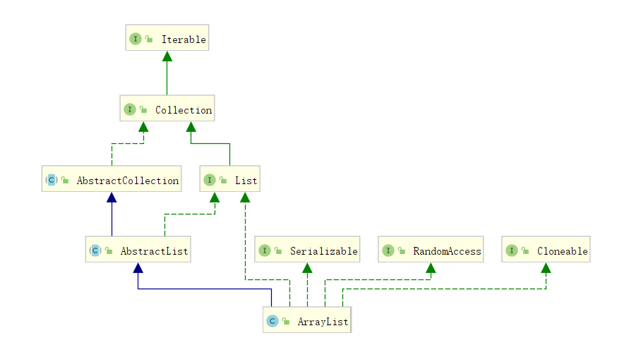

# ArrayList

`ArrayList` 底层基于数组实现，支持对元素进行快速随机访问，默认初始大小为 0，当第一次调用 `add()` 方法时容量会扩容为 10。

```java
public class ArrayList<E> extends AbstractList<E>
        implements List<E>, RandomAccess, Cloneable, java.io.Serializable
{}
```



## 成员变量

```java
private static final long serialVersionUID = 8683452581122892189L;
private static final int DEFAULT_CAPACITY = 10; // 默认的初始化容量
private static final Object[] EMPTY_ELEMENTDATA = {}; // 默认为空数组
private static final Object[] DEFAULTCAPACITY_EMPTY_ELEMENTDATA = {};
transient Object[] elementData; // 存放元素的数组
private int size; // 元素数量
```

## 构造函数

```java
    public ArrayList(int initialCapacity) {//初始化
        // ArrayList 初始容量设置为 initialCapacity
        // 如果 initialCapacity < 0 抛出异常
    }

    public ArrayList() {
        this.elementData = DEFAULTCAPACITY_EMPTY_ELEMENTDATA;// 默认为一个空数组
    }

    public ArrayList(Collection<? extends E> c) {
        elementData = c.toArray();
        if ((size = elementData.length) != 0) {// 如果给定的集合 c 数据有值
            // c.toArray might (incorrectly) not return Object[] (see 6260652)
            // 如果集合元素类型不是 Object类型，转成 Object
            if (elementData.getClass() != Object[].class)
                elementData = Arrays.copyOf(elementData, size, Object[].class);
        } else {
            this.elementData = EMPTY_ELEMENTDATA;
        }
    }
```

## 常用函数

### `add`

```java
public boolean add(E e) {}
public void add(int index, E element){}//在指定位置插入，arraycopy(src,sPos,dest,dPos,len);
public boolean addAll(Collection<? extends E> c) {}
public boolean addAll(int index, Collection<? extends E> c) {}
```

```java
public void add(int index, E element) {
    // 确保容量足够
    ensureCapacityInternal(size + 1);  // Increments modCount!!
    // 将[index, size]，复制到 [index + 1 - size+1]
    System.arraycopy(elementData, index, elementData, index + 1, size - index);
    elementData[index] = element;
    size++;
}
```

扩容 `ensureCapacityInternal`

```java
private void ensureCapacityInternal(int minCapacity) {
    ensureExplicitCapacity(calculateCapacity(elementData, minCapacity));
}

private static int calculateCapacity(Object[] elementData, int minCapacity) {
    //如果 elementData 为 默认的空数组，返回默认容量（10）与 minCapacity 中的较大者
    if (elementData == DEFAULTCAPACITY_EMPTY_ELEMENTDATA) {
        return Math.max(DEFAULT_CAPACITY, minCapacity);
    }
    return minCapacity;
}

private void ensureExplicitCapacity(int minCapacity) {
    modCount++;// 数组结构被修改次数加一
    // 如果所需的最小容量比数组容量还要大，说明容量不够，扩容
    if (minCapacity - elementData.length > 0)
        grow(minCapacity);
}

private void grow(int minCapacity) {
    int oldCapacity = elementData.length;
    //新容量为原来容量的3/2，即1.5倍
    int newCapacity = oldCapacity + (oldCapacity >> 1); 
    // 如果扩容后还不够，扩容后的大小就赋值为期望值minCapacity
    if (newCapacity - minCapacity < 0)
        newCapacity = minCapacity;
    // 如果扩容后的值超出 jvm 所能分配的最大值（Integer最大值-8），就用int最大值
    if (newCapacity - MAX_ARRAY_SIZE > 0)
        newCapacity = hugeCapacity(minCapacity);
    // 通过赋值进行扩容
    elementData = Arrays.copyOf(elementData, newCapacity);
}
```

通过扩容方法可以看到，当第一次使用 `add` 方法时，才会为 数组分配容量（除非使用的带参的构造函数），而且默认扩容为 10。

**add 总结**

1. 确保容量够用，如果不够，扩容
   * 扩容为原来的 1.5 倍
   * 如果容量还不够，就用 期望容量
   * 如果容量比最大容量\(`Integer.MAX_VALUE`-8\)还大，容量为 Integer 最大值
2. 调用 `arraycopy(src,sPos,dest,dPos,len);` 复制数组
3. 维护 size 变量

`add` 方法还是挺快的，虽然扩容操作需要复制一遍数组，但考虑到复杂度震荡，其时间复杂度还是为 O\(1\)

### `remove`

```java
public E remove(int index) {}
public boolean remove(Object o) {}
public boolean removeAll(Collection<?> c) {}
public boolean removeIf(Predicate<? super E> filter) {}
```

```java
public E remove(int index) {
    modCount++;
    // 获取旧值，用作返回值
    E oldValue = elementData(index);
    int numMoved = size - index - 1; // 计算需要移动的元素个数
    if (numMoved > 0)
        // 将 [index + 1, size-1] 复制到 [index, index + numMoved]
        System.arraycopy(elementData, index+1, elementData, index, numMoved);
    elementData[--size] = null; // clear to let GC do its work

    return oldValue;
}
```

`remove` 方法逻辑很简单：

* 获取要删除的值，用作返回值
* 计算需要移动都少元素
* 调用 `System.arraycopy(src, srcPos, dest, destPos, length)` 方法进行数组的移位

`remove` 方法需要移动元素，时间复杂度为 O\(n\)，消耗还是挺大的

> 注意，如果我们存的是 Integer 类型的元素，调用 remove\(int\) 方法，会删除什么元素呢？
>
> * 如果传入的是 int 原生类型的值，删除的是给定的下标值
> * 如果传入的是 Integer 包装类型的值，删除的就是指定的值了

### `clear`

```java
public void clear() {
    modCount++;
    // clear to let GC do its work
    for (int i = 0; i < size; i++)
        elementData[i] = null;

    size = 0;
}
```

### `get`

```java
public E get(int index) {
    rangeCheck(index);

    return elementData(index);
}
```

`get` 方法就是获取数组对应的下标值并返回，时间复杂度为 O\(1\);

### `indexOf`

```java
public int indexOf(Object o) {
    if (o == null) {
        for (int i = 0; i < size; i++)
            if (elementData[i]==null)
                return i;
    } else {
        for (int i = 0; i < size; i++)
            if (o.equals(elementData[i]))
                return i;
    }
    return -1;
}
```

`indexOf` 方法会遍历一遍数组，找到值位响应值的元素，并返回第一个下标值，时间复杂度为 O\(n\)

同理，`lastIndexOf` 方法也是遍历一遍数组，只不过是从数组尾往前遍历，时间复杂度也是 O\(n\)

### `set`

```java
public E set(int index, E element) {
    rangeCheck(index);

    E oldValue = elementData(index);
    elementData[index] = element;
    return oldValue;
}
```

`set` 方法会找到指定下标对应的元素，并修改，返回旧值。由于底层使用的是数组，支持时间复杂度为 O\(1\) 的随机访问，所以 `set` 方法的时间复杂度也为 O\(1\)

## 迭代器

```java
public Iterator<E> iterator() {
    return new Itr();
}
```

```java
private class Itr implements Iterator<E> {
    int cursor;       // 迭代过程中，下一个元素的位置，默认从 0 开始
    int lastRet = -1; //  表示上一次迭代过程中，索引的位置，即这次迭代完成后的索引
    int expectedModCount = modCount; 
}
```

### `hashNext`

```java
 public boolean hasNext() {
     // 判断是否到到最后一个元素了
     return cursor != size;
 }
```

### `next`

```java
@SuppressWarnings("unchecked")
public E next() { // 返回下一个元素
    //检查版本号有没有被修改，如果被修改了，抛 ConcurrentModificationException 异常
    checkForComodification();
    int i = cursor;

    Object[] elementData = ArrayList.this.elementData;
    cursor = i + 1; // cursor 加一，为下一次迭代做准备
    return (E) elementData[lastRet = i]; // 更新 lastRet，返回当前迭代元素
}
```

### `remove`

```java
public void remove() {
    // 如果上一次操作时，数组的位置已经小于 0 了，说明数组应被删除完了
    if (lastRet < 0)
        throw new IllegalStateException();
    checkForComodification();

    try {
        ArrayList.this.remove(lastRet); // 调用ArrayList的 remove 方法删除下标为lastRet的元素
        cursor = lastRet;// 更新 cursor 和 lastRet
        lastRet = -1; // 表示元素已经被删除，也放置重复删除
        expectedModCount = modCount;
    } catch (IndexOutOfBoundsException ex) {
        throw new ConcurrentModificationException();
    }
}
```

