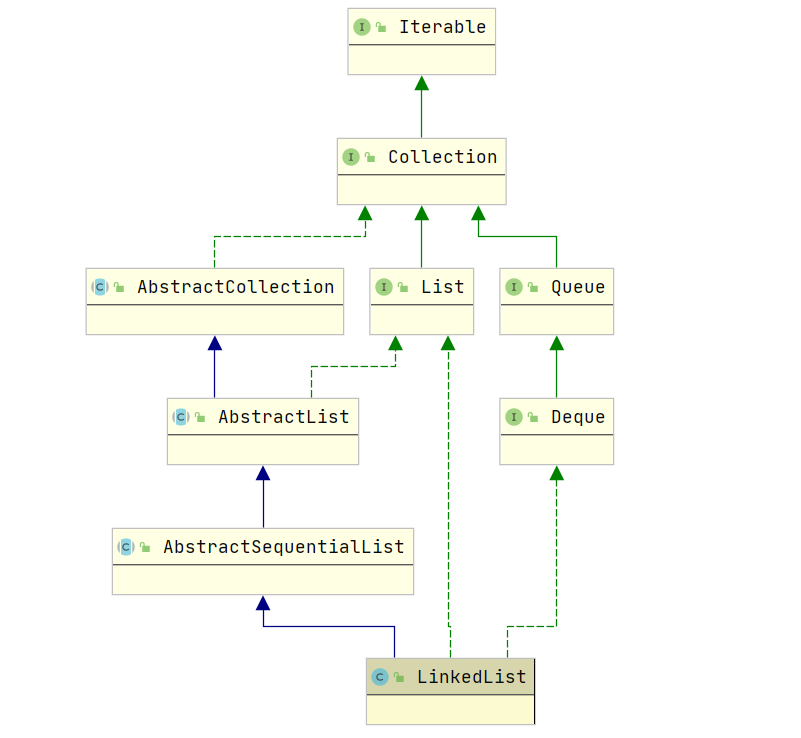

# LinkedList

LinkedList 底层是一个双向链表，链表节点维护了一个 `prev` 和 `next` 指针，用于找到节点的前驱节点和后继节点。LinkedList 实现了 `Deque` 双端队列，所以支持双端队列的方法。

LinkedList 适用于要求有顺序、并且会按照顺序进行迭代的场景，主要是依赖于底层的链表结构

```java
public class LinkedList<E> extends AbstractSequentialList<E> 
        implements List<E>, Deque<E>, Cloneable, java.io.Serializable{}
```



## 成员变量

```java
transient int size = 0; // 记录元素个数
transient Node<E> first; // 头结点
transient Node<E> last; // 尾节点
```

Node 节点定义如下

```java
private static class Node<E> {
    E item;
    Node<E> next;
    Node<E> prev;

    Node(Node<E> prev, E element, Node<E> next) {
        this.item = element;
        this.next = next;
        this.prev = prev;
    }
}
```

## 构造函数

```java
public LinkedList() {}

public LinkedList(Collection<? extends E> c) {
    this();
    addAll(c);
}
```

## 常用函数

### 添加

LinkedList 支持向链表头部、尾部和指定位置添加，其相关 API 如下

```java
public boolean add(E e) {} // 在链表尾部添加
public void add(int index, E element) {} // 在指定位置添加
public boolean addAll(Collection<? extends E> c) {} // 在尾部添加一个集合中中的所有元素
public boolean addAll(int index, Collection<? extends E> c) {} // 在指定位置添加
public void addFirst(E e) {} // 头插法添加
public void addLast(E e) {} // 尾插法添加
```

由于 LinkedList 实现了 `Deque` 接口，所以也拥有双端队列的相应方法

```java
public boolean offer(E e) { return add(e); } // 向尾部添加
public boolean offerFirst(E e) {} // 向头部添加
public boolean offerLast(E e) {} // 向尾部添加
```

```java
public void add(int index, E element) {
    // 检查下标是否合法
    checkPositionIndex(index);

    if (index == size) // 如果 下标 = size，直接在尾部插入
        linkLast(element);
    else // 否则，找到 index 的位置，插入元素
        linkBefore(element, node(index));
}
```

```java
void linkLast(E e) {
    final Node<E> l = last;
    final Node<E> newNode = new Node<>(l, e, null);
    last = newNode;
    if (l == null) // 说明没有元素，让头结点 = newNode(新插入的元素)
        first = newNode;
    else
        l.next = newNode; // 否则，直接添加到尾部
    size++;
    modCount++;
}
```

从源码可以看出，在链表尾部插入比较简单，直接修改指针的指向就行了。时间复杂度为 O\(1\)

```java
void linkBefore(E e, Node<E> succ) { // succ 为指定位置的节点
    // assert succ != null;
    final Node<E> pred = succ.prev;v // 记录原前驱节点
        final Node<E> newNode = new Node<>(pred, e, succ);
    succ.prev = newNode; // 将 succ 的前驱节点设置为 newNode
    if (pred == null)
        first = newNode;
    else
        pred.next = newNode; // 拼接链表
    size++;
    modCount++;
}
```

`linkBefore` 操作也只是修改了相应的节点而已，时间复杂度也是 O\(1\)，但是在插入之前需要使用 `node(index)` 找到相应节点，这个操作的时间复杂度为 O\(n\)。

其他方法与上面方法类似，只是在有些情况会使用头插法插入而已，关于头插法也很简单，这里就不再赘述了。

### 删除

LinkedList 支持删除链表头部、尾部和指定位置元素，其相关 API 如下

```java
public E remove() {} // 删除链表头结点
public E remove(int index) {} // 删除指定位置节点
public boolean remove(Object o) {} // 删除指定元素
public E removeFirst() {}
public E removeLast() {}
```

由于 LinkedList 实现了 `Deque` 接口，所以也拥有双端队列的相应方法

```java
public E poll() {} // 删除链表头结点
public E pollFirst() {}
public E pollLast() {}

public void push(E e) {}
public E pop() {}
```

```java
public E remove(int index) {
    checkElementIndex(index);
    return unlink(node(index));
}

E unlink(Node<E> x) {
    // assert x != null;
    final E element = x.item;
    final Node<E> next = x.next; // 记录后继节点
    final Node<E> prev = x.prev; // 记录前驱节点

    if (prev == null) {
        first = next;
    } else {
        prev.next = next;
        x.prev = null;
    }

    if (next == null) {
        last = prev;
    } else {
        next.prev = prev;
        x.next = null;
    }

    x.item = null;
    size--;
    modCount++;
    return element;
}
```

`unlink` 的操作只需要修改前驱节点和后继节点的指向就行了，时间复杂度为 O\(1\)，但是找到相应节点的时间复杂度为 O\(n\)

### 查询

```java
public E get(int index) {}
public E getFirst() {}
public E getLast() {}
public int indexOf(Object o) {}
public int lastIndexOf(Object o) {}
public E element() {return getFirst();}
```

由于 LinkedList 实现了 `Deque` 接口，所以也拥有双端队列的相应方法

```java
public E peek() {}
public E peekFirst() {}
public E peekLast() {}
```

```java
public E get(int index) {
    checkElementIndex(index);
    return node(index).item;
}

Node<E> node(int index) {
    // assert isElementIndex(index);
    if (index < (size >> 1)) { // 在前半部分查找
        Node<E> x = first;
        for (int i = 0; i < index; i++) // 遍历前半部分，查找对应元素
            x = x.next;
        return x;
    } else {
        Node<E> x = last;
        for (int i = size - 1; i > index; i--)
            x = x.prev;
        return x;
    }
}
```

从源码可以看出，查找指定位置元素的时间复杂度为 O\(n\)，虽然在遍历的时候最多只需要遍历一半的元素。

### 修改元素

```java
public E set(int index, E element) {
    checkElementIndex(index);
    Node<E> x = node(index);
    E oldVal = x.item;
    x.item = element;
    return oldVal;
}
```

从源码可以看出，修改元素需要先找到对应位置的节点，然后进行修改，所以时间复杂度也为 O\(n\)

## LinkedList 与 Queue 方法对比

| 方法含义 | 返回异常 | 返回特殊值 | 底层实现 |
| :---: | :---: | :---: | :---: |
| 新增 | add\(e\) | offer\(e\) | 底层实现相同 |
| 删除 | remove\(\) | poll\(e\) | 链表为空时，remove 会抛出异常，poll 返回 null |
| 查找 | element\(\) | peek\(\) | 链表为空时，element 会抛出异常，peek 返回 null |

