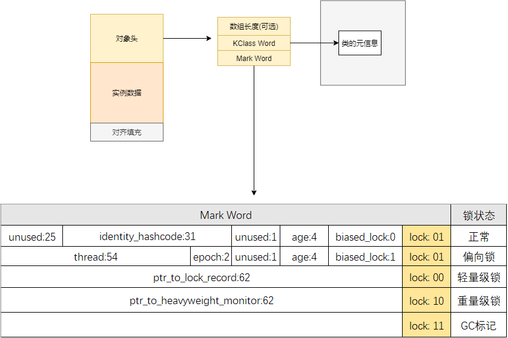
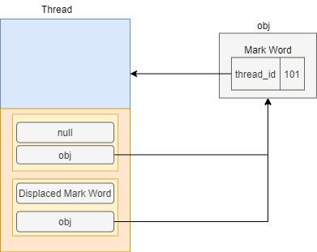
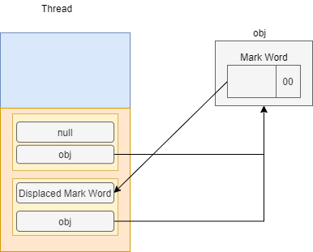
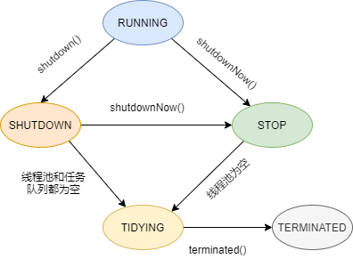

# 并发复习

## 并发基础

### 线程

#### 线程状态

* **NEW**：新建状态，线程被创建，但是还没有调用 start\(\) 方法
* **RUNNABLE**：运行状态，**线程将操作系统就绪态和运行态统称为 RUNNABLE**
* **BLOCKED**：阻塞态。线程等待 monitor 锁
* **WAITTING**：等待状态，等待另一个线程发送指令。调用 `wait/join/park` 后进入等待状态
* **TIME\_WAITTING**：计时等待，调用 `sleep/wait(time)/join(time)/parkNanos` 进入计时等待状态
* **TERMINATED**：终止状态，标识当前线程已经执行完毕

### sleep 与  wait

* sleep 是 Thread 的方法，wait 是 Object 的方法
* sleep 不释放锁，wait 释放锁
* sleep 苏醒后可以继续执行，wait 被唤醒后需要与其他线程竞争锁资源

## JMM

`Java内存模型(JavaMemoryModel)` 描述了 Java 程序中各种变量 \(线程共享变量\) 的访问规则，以及在 JVM 中将变量，存储到内存和从内存中读取变量这样的底层细节。

### as-if-serial

单线程下的执行结果不能被改变。

## happen-before

* **程序顺序行规则**：在一个线程中，如果 A 操作在 B 操作之前，那么 A happen-before B
* **`volatile` 变量原则**：对于 `volatile` 变量的写操作相对于后续的读操作可见
* **传递规则**：如果 A happen-before B，B happen-before C，则 A happen-before C
* **上锁原则**：一个锁的解锁 happen-before 后续对这个锁的加锁
* **线程启动原则**：A 线程启动子线程 B，那么`start()` 操作 happen-before B 中的任意操作，即 B 可以看到 A 在启动 B 前的操作
* **线程终结原则**：主线程 A 等待子线程 B 完成（A 调用 B 的 `join()` 方法），当子线程 B 完成后（`join()` 方法返回），主线程能看到子线程 B 的所有操作
* **线程中断原则**：线程 `interrupt()` 方法一定遭遇检测到线程的中断信号
* **对象终结原则**：一个对象初始化操作肯定闲鱼它的 `finalize()` 方法

### 乐观锁/悲观锁

对于同一个数据的并发操作，悲观锁认为自己在使用数据的时候一定有别的线程来修改数据，因此在获取数据的时候会先加锁，确保数据不会被别的线程修改。Java 中，synchronized 关键字和 Lock 的实现类都是悲观锁。

而乐观锁认为自己在使用数据时不会有别的线程修改数据，所以不会添加锁，只是在更新数据的时候去判断之前有没有别的线程更新了这个数据。如果这个数据没有被更新，当前线程将自己修改的数据成功写入。如果数据已经被其他线程更新，则根据不同的实现方式执行不同的操作（例如报错或者自动重试）。

乐观锁在 Java 中是通过使用无锁编程来实现，最常采用的是 CAS 算法，Java 原子类中的递增操作就通过 CAS 自旋实现的。

* 悲观锁适合写操作多的场景，先加锁可以保证写操作时数据正确。
* 乐观锁适合读操作多的场景，不加锁的特点能够使其读操作的性能大幅提升。

#### 公平锁/非公平锁

公平锁是指多个线程按照申请锁的顺序来获取锁，线程直接进入队列中排队，队列中的第一个线程才能获得锁。公平锁的优点是等待锁的线程不会饿死。缺点是整体吞吐效率相对非公平锁要低，等待队列中除第一个线程以外的所有线程都会阻塞，CPU 唤醒阻塞线程的开销比非公平锁大。

非公平锁是多个线程加锁时直接尝试获取锁，获取不到才会到等待队列的队尾等待。但如果此时锁刚好可用，那么这个线程可以无需阻塞直接获取到锁，所以非公平锁有可能出现后申请锁的线程先获取锁的场景。非公平锁的优点是可以减少唤起线程的开销，整体的吞吐效率高，因为线程有几率不阻塞直接获得锁，CPU 不必唤醒所有线程。缺点是处于等待队列中的线程可能会饿死，或者等很久才会获得锁。

#### 独占锁/共享锁

独享锁也叫排他锁，是指该锁一次只能被一个线程所持有。如果线程 T 对数据 A 加上排它锁后，则其他线程不能再对 A 加任何类型的锁。获得排它锁的线程即能读数据又能修改数据。JDK 中的 synchronized 和 JUC 中 Lock 的实现类就是互斥锁。

共享锁是指该锁可被多个线程所持有。如果线程 T 对数据 A 加上共享锁后，则其他线程只能对 A 再加共享锁，不能加排它锁。

## volatile

volatile 关键字可以用来修饰字段，其作用是告知程序任何对该变量的访问均需要从主内存中获取，而对它的改变必须同步刷新回主内存。

volatile 可以保证可见性和防止指令重排序

* **可见性**：当一个线程修改了一个 volatile 修饰的变量后，其他线程可以立刻得知这个变量的修改，拿到最这个变量最新的值。
* **有序性**：禁止指令重排序。有序性使通过内存屏障实现的，它在  volatile 读操作后分别加入了 `LoadLoad` 屏障和 `LoadStory` 屏障，在 volatile 写操作前后分别插入了 `StoreStore` 屏障和 `StoreLoad` 屏障 。它保证了在屏障前后的指令可以重排序，但是重排序的时候不能越过内存屏障。

在字节码文件中，volatile 被标识为 `ACC_VOLATILE`，其具体实现是通过 lock 指令来实现的。lock 指令会锁住变量所在的缓存区域，通过 MESI 协议，通知其他线程将该变量的缓存行设置为失效状态。其他线程读取该字段时，需要重新从主内存中读取。

**嗅探**

每个处理器通过嗅探在总线上传播的数据来检查自己缓存的值是不是过期了，当处理器发现自己缓存行对应的内存地址被修改，就会将当前处理器的缓存行设置成无效状态，当处理器对这个数据进行修改操作的时候，会重新从系统内存中把数据读到处理器缓存里。

**总线风暴**

**重排序**

### 伪共享

在 Cache 内部是按行存储的，其中每一行称为一个 Cache 行。Cache 行是 Cache 与主内存进行数据交换的单位，Cache 行的大小一般为 2 的幂次数字节。

当 CPU 访问一个变量时，首先会去看 CPU Cache 内是否有该变量，如果有，直接获取，否则从主内存中获取，然后把该变量所在内存区域的一个 Cache 行大小的内存复制到 Cache 中。

一个 Cache 行中可能有多个变量，当多个线程同时修改一个缓存行中的多个变量时，由于同时只能有一个线程可以操作缓存行，这就造成了伪共享。

**避免伪共享**

1. 字节填充
2. `sun.misc.Contended` 注解

### 使用场景

volatile 是一个轻量级的锁，适合多个线程**共享一个状态变量**，锁适合多个线程**共享一组状态变量**。可以**将多个线程共享的一组状态变量合并成一个对象**，用一个 volatile 变量来引用该对象，从而替代锁。

## synchronized

线程进入 synchronized 代码块前后，线程会获得锁，清空工作内存，从主内存拷贝共享变量最新的值到工作内存成为副本，执行代码，将修改后的副本的值刷新回主内存中，线程释放锁。

* 修饰普通方法，锁住本对象，字节码对应 `ACC_SYNCHRONIZED`
* 修饰静态方法，锁住类对象，字节码对应 `ACC_SYNCHRONIZED`
* 修饰方法块，锁住锁对象，字节码对应 `monitorenter` 和 `monitorexit`

### 对象头



### Monitor

每个 Java 对象都可以关联一个 Monitor 对象。当使用 synchronized 给对象上锁（重量级）之后，该对象头的 Mark Word 中就被设置了一个指向 Monitor 对象的指针。

#### 内部结构


* Contention List：所有请求锁的线程将被放入到 cxq 队列中
* EntryList：cxq 中有资格成为候选人的线程被移到 EntryList 中。因为 cxq 队列会被线程并发访问，所以使用 EntryList 将低
* WaitSet：调用 wait 方法被阻塞的线程放到 WaitSet 中
* OnDeck：任何时刻最多只能由一个线程
* Owner：获得锁的线程
* !Owner：释放锁的线程

#### 竞争过程

* 刚开始 Monitor 中的 Owner 为 null
* 当 synchronized 给对象加锁后，就会将 Monitor 所有者 Owner 设置为得到锁的线程
* 在线程持锁期间，如果有其他线程竞争锁，就会将其封装成一个 `ObjectWaiter` 放进 cxq\(ContentionList\) 队列中，然后调用 park 方法阻塞
* 线程释放锁之后，会从 cxq 或 `EntryList` 中挑选一个 onDeck 线程唤醒，让其竞争锁。当持有锁的线程释放锁前，会将 cxq 中的所有元素移动到 EntryList 中去
* 如果线程在持锁期间调用 wait 方法，将会进入 WaitSet 等待队列中，然后放弃当前对象的锁资源。当对象被唤醒时，会从 WaitSet 中移除，放入 EntryList 队列中，与其他线程一起竞争锁资源。当线程获取到资源时，会恢复到调用wait 方法前的状态。

### 偏向锁



**撤销**

1. 计算 hashCode\(\)
2. 当有其他线程竞争

**批量重偏向**

如果对象被多个线程访问，但是没有竞争，这时偏向锁会被撤销，升级为轻量级锁。

当某个类的对象撤销偏向次数达到一定阈值\(20次\)的时候 JVM 就认为该类不适合偏向模式或者需要重新偏向另一个对象，

但是当撤销偏向锁次数达到阈值 20 次后，JVM 会在给对象加锁时重新偏向到加锁线程

**批量撤销**

当撤销骗你像所阈值超过 40 次后，会将所有类的对象都变为不可偏向的。

### 轻量级锁



### 重量级锁

重量级锁会与一个 Monitor 锁对象关联。锁对象维护了一个计数器，当线程重入时，会将计数器加一，当释放锁时，会将计数器减一。当计数器为 0 时，表示线程释放了锁资源。

当一个线程竞争锁资源失败时，会加入 `ContentionList` 队列中阻塞。但线程释放锁资源时，会从队列中挑选一个线程作为 `OnDeck` 线程去竞争锁资源，竞争成功就会成为 Owner 线程。

### 自旋锁

重量级锁竞争的时候，可以使用自旋来进行优化。如果在线程自旋期间获取到了锁，该线程就会获取锁。如果自旋一定次数都没有获取锁，就会进入阻塞队列等待。

自旋次数时自适应的，比如刚刚对象一次自旋操作成功过，就认为这次自旋成功的可能性比较高，就会多自旋几次

#### 锁粗化

如果一个程序对同一个锁不间断、高频地请求、同步与释放，会消耗一定地系统资源。锁粗化会将多次锁地请求合并成一个请求，以降低短时间大量请求锁。

```java
public void doSomethingMethod(){
    synchronized(lock){
        //do some thing
    }
    // do some thing quickly
    synchronized(lock){
        //do other thing
    }
}
```

### 锁消除

锁消除时发生在编译器级别地一种锁优化方式。当一个锁对象不会被其他线程访问时，会对锁进行消除。

锁消除主要是通过逃逸分析来支持的。如果对上的共享数据不可能逃逸出去被其他对象访问到，那么就可以把他们当成私有数据对待，也就可以进行锁消除。

```java
public static String concatString(String s1, String s2) {
    // sb 的作用范围限制在方法内部
    StringBuffer sb = new StringBuffer();
    sb.append(s1); // 锁消除
    sb.append(s2);
    return sb.toString();
}
```

## 原子类

## AQS

### 排他锁

`acquire` 大致分为三步：

1. 使用 `tryAcquire` 方法尝试获取锁，成功直接返回，否则走 2
2. 把当前节点加入同步队列队尾
3. 自旋，将当前节点的前驱节点设置为 SIGNAL，然后阻塞自己

排他锁的释放比较简单，从队头开始，找到它的下一个节点，如果下一个节点是空的，就会从队尾开始，一直找到状态节点不是取消的节点，然后释放该节点

### 共享锁

获取共享锁的逻辑大致如下：

1. 尝试获取共享锁，成功直接返回，否则走 2
2. 封装为节点，加入同步队列尾部，走 3
3. 如果前驱节点是头结点，再次尝试获取共享锁，成功走 4，否则走 5
4. 将当前节点设置为头结点并唤醒，返回
5. 将当前节点的前驱节点设置为 SIGNAL，然后阻塞

## Lock

### ReentrantLock

总结一下公平锁定的加锁流程

* 如果 state 是否为 0，如果为 0，查看同步队列是否有排队线程，如果没有，CAS 加锁，否则加锁失败
* 如果 state 不为零
  * 其他线程持有锁，加锁失败
  * 本线程持有锁，锁重入，更新 state

总结一下解锁流程

* 将 state 变量减一
* 如果是锁重入，不会释放锁
* 如果减一后 state 为 0，将持锁线程设置为 0，唤醒后继节点

### ReadWriteLock

* **锁降级**：如果线程持有写锁，如果可以在不是放写锁的情况下，获取读锁，称为锁降级。`ReadWriteLock` 支持锁降级。
* **锁升级**：如果线程持有读锁，如果能够不释放读锁，直接获取写锁，称为锁升级。`ReadWriteLock` 不支持锁升级。

`ReentrantReadWriteLock` 底层使用的是 AQS，获取读锁的时候获取的是 AQS 中的共享锁；获取写锁的时候获取的是 AQS 中的排他锁。

读写锁适用于**读多写少**的场景。例如一个论坛，恢复可以看作写操作，浏览可以看作读操作。这是可以使用读写锁。

**问题**

* 读操作未达到一定量级性能比互斥锁低
* 读写锁有可能造成**写锁饥饿**

## 阻塞队列

## 并发集合

### `ConcurrentHashMap`

#### 底层实现

JDK 8 之前，`ConcurrentHashMap` 底层是 Segment 数组，Segment 继承了 `ReentrantLock`，默认有 16 个 Segment，允许 16 个线程并发执行。 **Segment 中有一个 `HashEntry` 数组**。当插入一个数据时，首先会通过 Unsafe 类**定位 Segment**，然后**再定位到 `HashEntry`**，如果 `HashEntry`为空，就按照模板创建 `HashEntry`，否则将数据插入到 `HashEntry` 链表中。

JDK 8 及 之后，`ConcurrentHashMap` 是基于 数组 + 链表 + 红黑树 实现的，并且使用 synchronized 和 CAS 操作来进行并发控制。`ConcurrentHashMap` 有一个字段 **`sizeCtl`**，主要就是来控制 table 的初始化和扩容的操作。在 table 数组初始化之前，`sizeCtl` 代表着应该初始化的大小；当 `sizeCtl` 为 -1 时表示有一个线程正在初始化 table 数组；当 `sizeCtl`为 -N 时，表示有 N-1 个线程正在 进行扩容；当 table 数组初始化之后，下一次进行扩容的大小。

**put**

在 put 时，会对当前的 table 进行无条件 for 循环 + CAS 直到 put 成功

* 如果没有初始化就先调用 `initTable()` 方法来进行初始化过程
* 如果**没有 hash 冲突就直接 CAS 插入**
* 如果还在进行扩容操作就先进行扩容，通过 `helpTransfer()` 调用多线程一起扩容，真正的扩容方法是 transfer\(\)，通过参数 `ForwardingNode` 支持扩容操作，将已处理的节点和空节点置为 `ForwardingNode`，并发处理时多个线程经过 `ForwardingNode` 就表示已经遍历了，就往后遍历
* 如果**存在 hash 冲突，就加锁来保证线程安全**，这里有两种情况，一种是链表形式就直接遍历到**尾端插入**，一种是红黑树就按照红黑树结构插入，
* 最后一个如果该链表的数量大于阈值 8，就要先转换成黑红树的结构，break 再一次进入循环
* 如果添加成功就调用 addCount（）方法统计 size，并且**检查是否需要扩容**

**get**

当获取一个键的值的时候，先会计算键的 hash 值，定位到 table 数组索引的位置，如果第一个节点符合就返回；如果遇到扩容的时候，会调用标志正在扩容节点 `ForwardingNode` 的 find 方法，查找该节点，匹配就返回；否则就遍历链表寻找与之相对应的值。

#### 扩容

JDK 8 以前，扩容操作并没有加锁，而是在 put 中为 Segment 加了锁。扩容时会创建一个新的 `HashEntry` 数组，这个数组的大小为原来的两倍，然后遍历 `HashEntry` 中的链表重新计算下标值。扩容完成之后，会使用头插法将需要插入的 Entry节点插入到相应位置。

JDK 8 之后，先判断传入的新数组是否为空，如果为空，就为新数组开辟一个原数组两倍的空间。在拷贝的时候，会**把原数组的槽点锁住**，拷贝成功之后，会把原数组的槽点**设置为转移节点**，这样如果有数据需要 put 到 该节点时，发现该槽点是转移节点，就会一直等待，直到扩容成功之后才能继续 put。

#### 线程安全

1. 存储 Map 数据的**数组被 volatile 关键字修饰**，一旦被修改，立马就能通知其他线程
2. **put** 时，如果计算出来的数组下标索引没有值的话，采用无限 for **循环 + CAS 算法，来保证一定可以新增成功**，又不会覆盖其他线程 put 进去的值
3. 如果 put 的节点正好在扩容，会等待扩容完成之后再进行 put。保证了在扩容时，老数组的值不会发生变化
4. 对数组的桶进行操作时，会**先锁住桶**，保证只有当前线程才能对桶上的链表或者红黑树进行操作。
5. 红黑树旋转时，会**锁住根节点**，保证旋转式的线程安全

ConcurrentLinkedQueue 出入队如何不并发控制会产生什么问题，讲述出入对的 CAS 操作

ConcurrentHashMap 如何保证线程安全，并发度大小，jdk1.8 有什么变化

### CopyOnWriteArrayList

* 读不加锁
* 写的时候复制一份副本，在副本上操作。

优点：保证多线程的并发读写安全

缺点：

* 内存消耗，数组拷贝。可能造成频繁 gc。可以考虑压缩数据（n进制）或 ConcurrentHashMap
* 数据一致性：只能保证数据的最终一致性，可能读取到旧数据

**使用场景**

白名单、黑名单、商品类目的访问和更新场景

## 线程池

* **线程池状态**

  在线程池中，线程的状态和工作的线程数量使用一个 `AtomicInteger` 类型的原子变量 `ctl` 表示。其高 3 位 表示线程的状态，低 29 位标识工作线程数量

  线程池状态：

  * `RUNNING`：接收新任务并处理阻塞队列中的任务
  * `SHUTDOWN`：拒绝新任务，但处理阻塞队列中的任务
  * `STOP`：拒绝新任务并抛弃阻塞队列中的任务，同时中断正在处理的任务
  * `TiDYING`：所有任务执行完后线程池活动线程数为 0，将要调用 `terminated()` 方法
  * `TERMINATED`：`terminated()` 方法调用完成以后的状态



### 线程池的好处

1. 降低资源消耗，复用一创建的线程，降低线程创建和消耗的开销
2. 提高响应速度，当任务到达时，任务可以不需要等待线程创建就可以立即执行
3. 提高线程的可管理性，线程时稀缺资源，如果无限制创建不仅会消耗资源，还会降低系统的稳定性。使用线程池可以进行统一分配、调优和监控

### 如何创建线程池

1. 自己创建线程池
2. 利用线程池提供的工具类 `Executors` 可以创建线程池
3. `newFixedThreadPool`：创建固定大小的线程池，阻塞队列使用 `LinkedBlockingQueue` 无界队列
4. `newSingleThreadExecutor`：创建一个线程的线程池，阻塞队列使用 `LinkedBlockingQueue` 无界队列`newSingleThreadExecutor`
5. `newCachedThreadPool`：创建一个按需创建线程的线程池。同步队列中最多只有一个任务，加入的任务会立即执行
6. `newScheduledThreadPool`

### 线程池工作原理

* 刚开始线程池中没有线程
* 如果当前 工作线程数量小于核心线程数量，创建一个新线程来执行线程
* 如果 核心线程数 &lt; 工作线程数 &lt; 最大线程数，将任务加入到阻塞队列中
* 如果队列满了，并且 核心线程数量小于最大线程数量，创建一个线程执行任务
* 如果队列满了，并且 核心线程数量大于等于最大线程数量，拒绝任务

### 线程池的参数

* `corePoolSize`：核心线程数，线程池完成初始化后，默认情况下，线程池中没有线程，当由任务到来时，才会创建新线程去执行任务
* `maximumPoolSize`：最大线程数。在核心线程数量的基础上会额外增加的线程。
* `keepAliveTime`：线程空闲但是保持不被回收的事件。如果线程池当前线程数量大于 `corePoolSize`，那么多余的线程空闲时间超过 `keepAliveTime` 时会被回收
* `unit`：事件单位
* `workQueue`：存储线程的队列
* `threadFactory`：创建线程的工厂，目的是为了统一创建线程的方式。`Executors`内部默认的线程工厂 `DefaultThreadFactory` 为每个线程指定了相同的优先级和命名前缀
* `handler`：拒绝策略，默认抛出异常

### 提交新任务处理流程

* 如果当前 工作线程数量小于核心线程数量，创建一个新线程来执行线程
* 如果 核心线程数 &lt; 工作线程数 &lt; 最大线程数，将任务加入到阻塞队列中
* 如果队列满了，并且 核心线程数量小于最大线程数量，创建一个线程执行任务
* 如果队列满了，并且 核心线程数量大于等于最大线程数量，拒绝任务

### `executor()` 与 `submit`

```submit()`` 调用 `executor()` 来提交任务

1. **executor 只能接收 `Runnable` 类型的参数，而 `submit` 既可以接收 `Runnable` 类型的参数，又能接收 `Callable` 类型的参数。**因为 `submit` 方法将任务包装成了 `RunnableFuture` 类型，而 `RunnableFuture` 同时继承了 `Runnable` 接口和 `Future` 接口

   ```java
   public <T> Future<T> submit(Runnable task, T result) {
       if (task == null) throw new NullPointerException();
       // 将任务包装成 RunnableFuture
       RunnableFuture<T> ftask = newTaskFor(task, result); 
       execute(ftask);
       return ftask;
   }
   protected <T> RunnableFuture<T> newTaskFor(Runnable runnable, T value) {
       return new FutureTask<T>(runnable, value);
   }
   ```

2. `**executor` 没有返回值，`submit` 有返回值，\*\*返回值为 `Future` 类型
3. 发生异常时，`**execute` 方法会抛出异常，`submit` 只有调用 `get` 方法时才会抛出异常\*\*

### 拒绝策略

1. `AbortPolicy`：抛出异常\(默认\)
2. `DiscardPolicy`：丢弃当前任务
3. `DiscardOldestPolicy`：丢弃队列中最老的任务，将新任务加入队列

   ```java
   public void rejectedExecution(Runnable r, ThreadPoolExecutor e) {
       if (!e.isShutdown()) {
           e.getQueue().poll();
           e.execute(r);
       }
   }
   ```

4. `CallerRunsPolicy`：执行该任务，直接调用任务的 `run` 方法

   ```java
   public void rejectedExecution(Runnable r, ThreadPoolExecutor e) {
       if (!e.isShutdown()) {
           r.run();
       }
   }
   ```

5. 自定义拒绝策略，实现 `RejectedExecutionHandler` 接口，实现 `rejectedExecution`方法

### 关闭线程池

调用 `shutdown` 后，线程池旧不会再接收新的任务了，但是再工作队列中的任务仍然会执行，该方法会立即返回。

调用 `shutdownNow()` 后，线程池不会再接收新任务，并会丢弃工作队列中的任务，正在执行的任务也会被中断。

`tryTerminate` 方法将会尝试关闭线程池

### 线程池线程抛出异常，怎么处理

发生异常时，`execute` 方法会抛出异常，`submit` 只有调用 `get` 方法时才会抛出异常。

一个线程抛出异常，不会影响其他线程，发生异常的线程会被回收

线程池中线程抛出异常不能用常规方法捕获，可以利用 `UncaughtExceptionHandler` 来统一处理异常

```java
public class MyUncaughtExceptionHandler implements Thread.UncaughtExceptionHandler {
    private String name;

    public MyUncaughtExceptionHandler(String name) {
        this.name = name;
    }

    @Override
    public void uncaughtException(Thread t, Throwable e) {
        Logger logger = Logger.getAnonymousLogger();
        logger.log(Level.WARNING, "线程异常，终止啦" + t.getName());
        System.out.println(name + "捕获了异常" + t.getName() + "异常");
    }
}
```

```java
public class UseOwnUncaughtExceptionHandler implements Runnable {
    public static void main(String[] args) throws InterruptedException {
        Thread.setDefaultUncaughtExceptionHandler(new MyUncaughtExceptionHandler("捕获器"));

        new Thread(new UseOwnUncaughtExceptionHandler(), "MyThread-1").start();
        Thread.sleep(300);
        new Thread(new UseOwnUncaughtExceptionHandler(), "MyThread-2").start();
        Thread.sleep(300);
        new Thread(new UseOwnUncaughtExceptionHandler(), "MyThread-3").start();
    }

    @Override
    public void run() {
        throw new RuntimeException();
    }
}
```

### 合理设置线程池

### 自己实现线程池

```java

```

线程池的一些参数问题以及底层原理AQS

