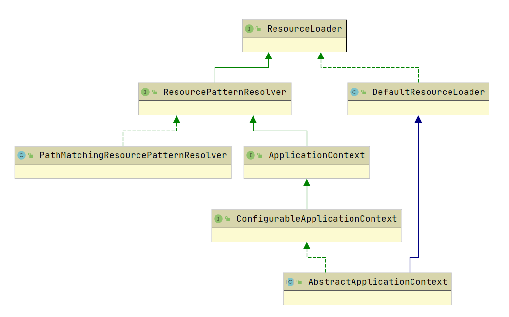

# ResourceLoader

Spring 将资源抽象为了 Resource，将资源的定义和资源的加载区分开了。但是为了访问不同的资源，必须使用相应的 `Resource` 实现类。而 `ResourceLoader` 提供了根据资源地址，构建相应资源实例。



`ResourceLoder` 用于实现不同的 Resource 加载策略，提供按需访问特定类型的 `Resource`。

```java
public interface ResourceLoader {

    String CLASSPATH_URL_PREFIX = ResourceUtils.CLASSPATH_URL_PREFIX;

    Resource getResource(String location);

    @Nullable
    ClassLoader getClassLoader();
}
```

## DefaultResourceLoader

`DefaultResourceLoader` 实现了 `ResourceLoader` 接口，提供了其方法的实现，是 `ResourceLoader` 的默认实现。

`DefaultResourceLoader` 最重要的是 `getResource` 方法，他根据提供的 location 返回相应的 Resource。

```java
public Resource getResource(String location) {
    Assert.notNull(location, "Location must not be null");

    // ProtocolResolver：用户自定义资源解析策略
    for (ProtocolResolver protocolResolver : getProtocolResolvers()) {
        Resource resource = protocolResolver.resolve(location, this);
        if (resource != null) {
            return resource;
        }
    }

    // 如果以 "/" 开头，则构造 ClassPathContextResource
    if (location.startsWith("/")) {
        return getResourceByPath(location);
    }
    // 如果以 "classpaath:" 开头，则构造 ClassPathResource
    else if (location.startsWith(CLASSPATH_URL_PREFIX)) {
        return new ClassPathResource(location.substring(CLASSPATH_URL_PREFIX.length()), getClassLoader());
    }
    else {
        // 构造 URL，尝试通过它进行资源定位，若没有，ClassPathContextResource
        // 判断是否为 FileURL，如果是，构造 FileURLResource，否则构造 URLResource
        try {
            // Try to parse the location as a URL...
            URL url = new URL(location);
            return (ResourceUtils.isFileURL(url) ? new FileUrlResource(url) : new UrlResource(url));
        }
        catch (MalformedURLException ex) {
            // No URL -> resolve as resource path.
            // ClassPathContextResource
            return getResourceByPath(location);
        }
    }
}
```

这里使用了策略模式。`Resource` 相当于策略接口，通过 `DefaultResourceLoader` 来决定返回哪个具体的实现类。

* 若 location 以 "/" 开头，构造 `ClassPathContextResource`
* 若 location 以 "classpath:"开头，构造 `ClassPathResource`
* 否则构造 URL
  * 资源为 `FileURL`，构造 `FileUrlResource`
  * 否则构造 `UrlResource`
  * 没有该资源抛出 `MalformedURLException` 异常，构造 `ClassPathContextResource`

接下来看一个测试用例：

```java
public static void main(String[] args) {
    ResourceLoader resourceLoader = new DefaultResourceLoader();
    Resource resource = null;
    String location = "";

    location = "/spring/spring-config.xml";
    resource = resourceLoader.getResource(location);
    System.out.println(resource.getClass());

    location = "classpath:spring/spring-config.xml";
    resource = resourceLoader.getResource(location);
    System.out.println(resource.getClass());

    // 文件，构造 FileUrlResource
    location = "file:/spring/spring-config.xml";
    resource = resourceLoader.getResource(location);
    System.out.println(resource.getClass());

    // 不是文件，构造 UrlResource
    location = "https://cn.bing.com/";
    resource = resourceLoader.getResource(location);
    System.out.println(resource.getClass());

    // 抛出 MalformedURLException 构造 ClassPathContextResource
    location = "spring/spring-config.xml";
    resource = resourceLoader.getResource(location);
    System.out.println(resource.getClass());
}
```

执行结果如下：

```java
class org.springframework.core.io.DefaultResourceLoader$ClassPathContextResource
class org.springframework.core.io.ClassPathResource
class org.springframework.core.io.FileUrlResource
class org.springframework.core.io.UrlResource
class org.springframework.core.io.DefaultResourceLoader$ClassPathContextResource
```

## ResourcePatternResolver

`ResourceLoader` 只支持根据一个 location 返回一个实例，为了一次获取多个资源，Spring 提供了 `ResourcePatternResolver` 接口，同时还新增了一个协议前缀 "classpath\*:"。

```java
public interface ResourcePatternResolver extends ResourceLoader {

    String CLASSPATH_ALL_URL_PREFIX = "classpath*:";

    Resource[] getResources(String locationPattern) throws IOException;
}
```

### PathMatchingResourcePatternResolver

`PathMatchingResourcePatternResolver` 实现了 `ResourcePatternResolver` 接口，在改类中包含了对 `ResourceLoader` 的引用，这也意味着继承 `ResourceLoader` 的方法的实现会代理给该引用。在找到一个匹配的资源时，就可以使用 `ResourceLoader` 的引用，将 location 解析成 Resource 实例。

```java
public Resource[] getResources(String locationPattern) throws IOException {
    Assert.notNull(locationPattern, "Location pattern must not be null");
    if (locationPattern.startsWith(CLASSPATH_ALL_URL_PREFIX)) {
        // a class path resource (multiple resources for same name possible)
        if (getPathMatcher().isPattern(locationPattern.substring(CLASSPATH_ALL_URL_PREFIX.length()))) {
            // a class path resource pattern
            return findPathMatchingResources(locationPattern);
        }
        else {
            // all class path resources with the given name
            return findAllClassPathResources(locationPattern.substring(CLASSPATH_ALL_URL_PREFIX.length()));
        }
    }
    else {
        // Generally only look for a pattern after a prefix here,
        // and on Tomcat only after the "*/" separator for its "war:" protocol.
        int prefixEnd = (locationPattern.startsWith("war:") ? locationPattern.indexOf("*/") + 1 :
                         locationPattern.indexOf(':') + 1);
        if (getPathMatcher().isPattern(locationPattern.substring(prefixEnd))) {
            // a file pattern
            return findPathMatchingResources(locationPattern);
        }
        else {
            // a single resource with the given name
            return new Resource[] {getResourceLoader().getResource(locationPattern)};
        }
    }
}
```

由于 `AbstractApplication` 继承了 `DefaultResourceLoader` ，所以在将自己作为参数，构造了一个 `PathMatchingResourcePatternResolver`，然后通过调用 `getResources` 方法来获取资源。

```java
public AbstractApplicationContext() {
    this.resourcePatternResolver = getResourcePatternResolver();
}

protected ResourcePatternResolver getResourcePatternResolver() {
    return new PathMatchingResourcePatternResolver(this);
}

public Resource[] getResources(String locationPattern) throws IOException {
    return this.resourcePatternResolver.getResources(locationPattern);
}
```

