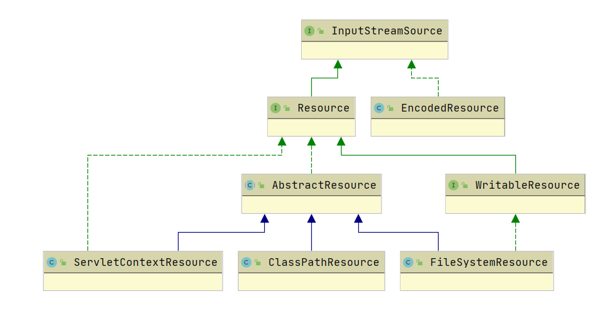
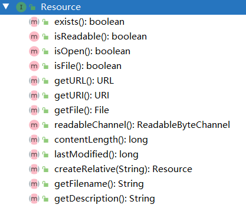

# Resource

在 Java 中，资源被抽象为 URL，我们可以通过 URL 中的 protocol 来处理不同资源的操作逻辑。而 Spring 将物理资源的访问方式抽象为 Resource。

Resource 继承体系如下：



Resource 接口是 Spring 访问物理资源的抽象，其本身并不提供任何资源访问的实现，具体的访问由该接口的实现类来完成，每个实现类都代表一种资源的访问策略。

`Resource` 只提供了相应的读操作



## EncodedResource

`EncodedResource` 实现了 `InputStream` 接口，主要对文件的编码进行处理。其具体的实现是由 `getReader` 方法来实现的。

```java
public Reader getReader() throws IOException {
    if (this.charset != null) {
        return new InputStreamReader(this.resource.getInputStream(), this.charset);
    }
    else if (this.encoding != null) {
        return new InputStreamReader(this.resource.getInputStream(), this.encoding);
    }
    else {
        return new InputStreamReader(this.resource.getInputStream());
    }
}
```

设置了编码属性之后，Spring 就会以相应的编码作为输入流的编码。

## AbstractResource

`AbstractResource` 主要提供了对 Resource 接口的方法的默认的公共实现。所以如果想要自定义 Resource，不推荐实现 `Resource` ，而应该继承 `AbstractResource`

## ServletContextResource

`ServletContextResource` 是为访问 Web 容器上下文中的资源而设计的类，负责以相对于 Web 应用根目录的路径加载资源，它支持以流和 URL 的方式访问，在 war 解包的情况下，也可以通过 File 的方式访问，该类还可以直接从 jar 包中访问资源。针对于 ServletContext 封装的资源，用于访问 ServletContext 环境下的资源。

## ClassPathResource

`ClassPathResource` 是用来访问类加载路径下的资源，其主要优势是方便访问类资源路径下的资源。

## FileSystemResource

`FileSystemResource` 用于访问文件系统资源，这个类并没有太大的优势，因为 Java 自身也提供了读取文件系统资源的方法。

由于 `Resource` 中都是读操作，为了支持写操作，`FileSystemResource` 实现了 `WritableResource` 接口。

