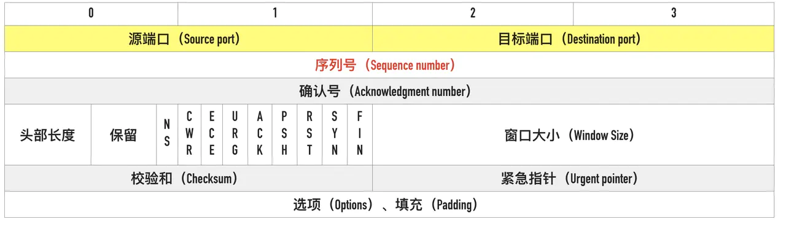
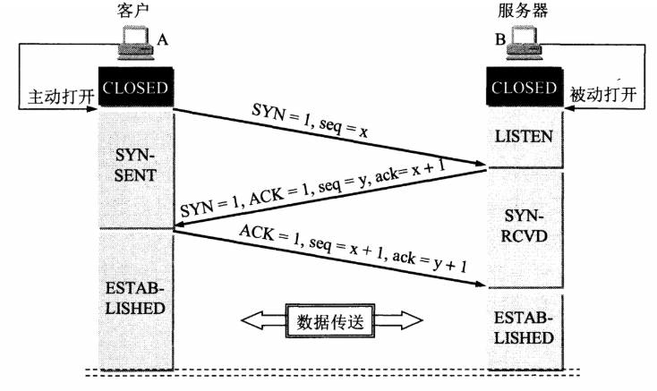
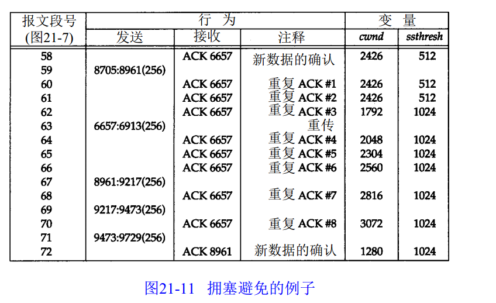

# 传输层

## TCP

### TCP 报文结构

### 三次握手

* **第一次握手**：客户端发送 SYN 包，其中将 SYN 值位为 1，并随机选择一个起使 ISN 序号 x。该报文段会封装在一个 IP 数据报中，并发送给服务器，然后客户机进入 `SYN-SEND` 状态，等待服务器确认。
* **第二次握手**：服务器收到客户端发送的 SYN 包后，会为该 TCP 连接分配 TCP 缓存和变量，并向客户机 TCP 发送允许连接的报文段（SYN+ACK 报文段）。该报文段中，将 SYN 值为 1，确认好字段 ack 为收到 SYN 包序号 +1\(x + 1\)。同时，服务器随机选择一个序列号 ISN y。然后服务器进入 `SYN-RECV` 状态。
* **第三次握手**：客户端收到服务器的 SYN + ACK 报文后，客户端也要给连接分配缓存和变量。客户机还会向服务器发送一个报文段，来对服务器的允许连接的报文段进行确认。在该包中，确认字段 ack 设置为收到的 SYN + ACK 包中的序列号 + 1 \(y + 1\)。然后客户端进入 `ESTABLISHED`状态。


**三次握手的原因**

**第三次握手是为了防止失效的连接请求到达服务器，让服务器错误打开连接。**

如果没有第三次握手，客户端发送的连接请求可能会在网络中长时间滞留，以至延误到连接释放以后才到达服务器，但服务器会认为这是一次新的请求，于是会发出确认报文段，同意建立连接，但是客户机不会理睬服务器的确认，也不会向服务器发送数据，造成服务器一直等待客户端发数据。

如果有第三次握手，客户端会忽略服务器之后发送的对滞留连接的确认，不进行第三次握手，因此不会再次打开连接。


### 四次挥手

* 客户端发送发送一个连接释放报文段，并停止发送数据。该报文段中将 FIN 置为 1，序列号为前面已传送过的数据的最后一个字节序号 + 1（u），然后进入 `FIN-WAIT-1` 状态。
* 服务器收到连接释放报文后发送一个 ACK 确认，确认号为收到序列号 + 1（ack=u+1），序号为服务器以传送过的数据的最后一个字节的序号 + 1（v）。然后进入 `CLOSE-WAIT` 状态。客户端收到来自服务端的确认后进入 `FIN-WAIT-2` 状态，等待服务端发出的连接释放报文。
* 服务端数据发送完毕后，会像客户端发送连接释放报文段，将 FIN 置为 1。服务端还必须重复上次已发送过的确认好 ack = u + 1。服务端进入 `LAST-ACK` 状态，等待客户端确认。
* 客户端收到来自服务端的连接报文段后，必须发出确认。在确认报文段中，ACK 置为 1，确认号为 ack = w + 1，序列号为 seq = u + 1。然后进入 `TIME-WAIT` 状态。等待 2MSL 后，客户端进入 `CLOSED` 状态。

> 在 TIME-WAIT 状态必须等待 2MSL 的原因：
>
> ① 为了**保证客户端发送的最后一个 ACK 报文段的确认能够到达服务端。**如果服务端没有收到该确认，会超时重传 FIN + ACK 报文段。如果不等待，会导致服务器无法按照正常步骤进入 CLOSE 状态。服务端收到了确认后，进入 CLOSED 装填。
>
> ② **防止已失效连接请求报文段。**如果客户端发送完最后一个 ACK 报文段后，再经过 2MSL，就可以使本连接持续的时间内所产生的所有报文段都从网络中消失。这样就可以使下一个新的连接中不会出现旧的连接请求报文段。

### 滑动窗口

发送方和接收方都有一个窗口，接收方通过 TCP 报文段中的窗口字段告诉发送方自己的窗口大小，发送方根据这个值和其他信息设置自己的窗口大小。

当接收方通告窗口大小为 0 时，发送方就不能向接收方发送数据了。等到接收方有可用缓存区时（至少2个报文段长度），会发送一个窗口更新公告，通知发送方发送数据。为了防止窗口更新公告的丢失，接收方有一个坚持定时器，用于周期性地向接收方发送一个探测包，探测接收方的窗口是否展开了。

### 拥塞控制

TCP 主要通过四个算法来进行拥塞控制：慢启动、拥塞避免、快重传、快回复

发送方会维持一个叫做拥塞窗口 cwnd 的状态变量。拥塞窗口的大小取决于网络的拥塞程度，并且动态地在变化。

发送方控制拥塞窗口的原则：

* 网络没有出现拥塞，拥塞窗口就可以增大一些，以便把更多的分组发送出去，这样可以提高网络的利用率。
* 网络出现拥塞或可能出现拥塞，就必须把拥塞窗口减小一些，以减少注入到网络中的分组数，以便缓解网络出现的拥塞。

#### **慢启动**

拥塞窗口被初始化为一个报文段。每收到一个 ACK，拥塞窗口就增加一个报文段。经过 k 轮发送后，拥塞窗口就会变为 2^k （拥塞窗口小于滑动窗口的情况下）。

#### **拥塞避免**

如果 crwn &gt; ssthresh ，就不再执行慢启动，而是执行拥塞避免算法。在拥塞避免算法中，每收到一个确认，cwnd 增加 1/cwnd。

当发生超时，sshressh 会被设置为当前窗口大小的一半，crwnd 被重新设置为 1，开始慢启动

#### **快重传**

快重传算法要求每次接收到报文段都应该对最后一个已收到的有序报文段进行确认。例如已经接收到 M1 和 M2，此时收到 M4，应当发送对 M2 的确认。

在发送方，如果收到三个重复确认，这是很可能是有报文段丢失了，此时执行快重传，立即重传下一个报文段，进入快恢复阶段。这时不采用慢启动是因为接收方只有在收到另一个报文段时才会产生重复的 ACK，这就说明此时网络状态还比较畅通。

#### **快恢复**

在快恢复阶段，做如下处理：

* 收到第 3 个重复的 ACK 时，设置ssthresh = cwnd / 2，cwnd = ssthresh + 3 \* MSS
* 每次收到另一个重复的 ACK 时，cwnd 增加一个报文段大小并发送一个分组
* 当下一个确认新数据的 ACK 到达时，设置 cwnd = ssthresh，结束快恢复，进入拥塞避免。

总结一下拥塞控制：

* 执行慢开始，拥塞窗口指数级增加
* 当 ssthresh &gt; crwn，执行拥塞避免，拥塞窗口每经过一轮增加 1
* 如果发送重传
  * 超时重传，ssthresh = cwnd / 2; cwnd = 1; 执行慢开始
  * 三次重复确认，ssthresh = crwnd / 2; cwnd = ssthresh；执行拥塞避免

