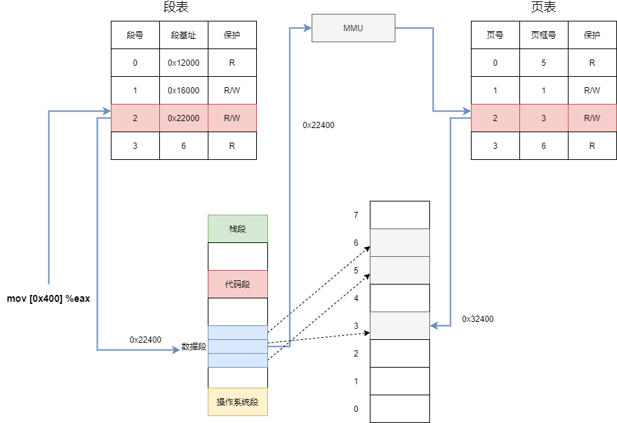

# 操作系统复习

## 进程管理

### 进程状态


* **NEW 新建态**
* **RUNNABLE 就绪态**：进程具备运行条件，等待系统分配处理器以便运行
* **RUNNING 运行态**：进程占有处理器，正在运行
* **BLOCKED 阻塞态**：进程不具备运行条件，正在等待某个事件的完成
* **TERMINAL 终止态**

**只有就绪态和运行态可以相互切换**

### 孤儿进程

一个进程退出，而它的一个或多个子进程还在运行，那么那些子进程将成为孤儿进程。

为避免孤儿进程退出时无法释放所占用的资源而僵死，孤儿进程将被 init 进程（进程号为 1）所收养（自动接收为子进程），并由 init 进程完成对他们完成状态收集工作

RPC 过程中也会产生孤儿进程，例如客户端进程发起请求后突然崩溃，且对应的服务器端进程仍在运行，则该服务器进程就会称为孤儿进程

### 僵尸进程

当**子进程比父进程先结束，而父进程又没有回收子进程**，释放子进程资源，此时子进程将成为僵尸进程

一个进程使用 fort 创建子进程，如果子进程退出，而父进程没有调用 wait 或 waitpid 获取子进程的状态信息，那么子进程的进程描述符仍然保存在系统中，这种进程称为僵尸进程

**危害**

在每个进程退出时，内核释放该进程所有资源，包括打开文件、占用的内存等，但是仍让保留一定的信息（包括进程号、退出状态、运行时间等），知道父进程通过 wait/waitpid 来取时才释放。

**如果父进程没有回收子进程的资源，则子进程的进程号就会一直被占用，但是系统的进程号是有限的**，如果产生大量僵尸进程，将会因为没有可用的进程号而导致系统不能产生新的进程

**解决方法**

通过 ps 命令查看子进程的状态是 “Z”，使用 kill 命令杀死僵尸进程。

1. kill 僵尸进程
2. 在父进程创建子进程之前，就向系统申明自己并不会对这个子进程的 exit 动作进行任何关注行为，这样的话，子进程一旦退出后，系统就不会去等待父进程的操作，而是直接将该子进程的资源回收掉，也就不会出现僵尸进程了。具体的办法就是，在父进程的初始化函数中，调用这个函数：signal \(SIGCHLD,SIG\_IGN\)
3. kill 父进程，让其称为孤儿进程
4. 父进程调用 wait/waitpid，等待子进程返回
5. 在父进程创建子进程的时候，连续调用两次 fork \(\)，而且使紧跟的子进程直接退出，使其孙子进程成为孤儿进程，从而 init 进程将代替父进程来接手，负责清除这个孤儿进程。于是，父进程就无需进行任何的清理行为，系统会自动处理；

### 进程与线程的切换

#### 进程切换

1. 陷入到内核态
2. 切换到另一个进程的线程的内核态
3. 切换到用户态

#### 线程切换

1. 陷入内核态
2. 切换到另一个线程

### 进程间通讯 IPC

* 管道：一种半双工的通信方式，数据只能单向流动
  * 无名管道（内存文件）：只有亲缘关系的进程之间使用，通常指父子进程
  * 命名管道：允许没有亲缘关系的进程间使用，先进先出
* 共享内存：多个进程将统一文件映射到他们的地址空间，允许多个进程共享
* 消息队列：
* 套接字：
* 信号量：

### 调度算法

#### **1. 先来先服务 FCFS**

非抢占式的调度算法，按照请求的顺序进行调度

有利于长作业，但不利于短作业，因为短作业必须一直等待前面的长作业执行完毕才能执行。

#### **2. 短作业优先 SJF**

* 非抢占式：按估计运行事件最短的顺序进行调度
* 抢占式：按剩余时间最短的顺序进行调度

周转时间最短，但是长作业有可能饿死

#### **3. 时间片轮转 RR**

所有就绪进程按 FCFS 的原则排成一个队列，每次调度时，把 CPU 时间分配给队首进程，该进程执行一个时间片

当时间片用完时，由计时器发出时钟中断，调度程序便停止该进程的执行，并将其送往就绪队列的末尾，同时继续把时间片分配给队首进程

* 时间片太小，会导致进程切换太频繁，在进程切换上花费太多时间
* 时间片太大，实时性得不到保证

#### **4. 优先级调度**

为每个进程分配一个优先级，按优先级进行调度

为防止低优先级的进程永远得不到调度，可以随着时间的推移增加等待进程的优先级

#### **5. 多级反馈队列**

一个进程需要执行 100 个时间片，如果采用时间片轮转调度算法，那么需要交换 100 次。

多级队列是为这种需要连续执行多个时间片的进程考虑，它设置了多个队列，**每个队列时间片大小都不同**，例如 1,2,4,8,..。进程在第一个队列没执行完，就会被移到下一个队列。这种方式下，之前的进程只需要交换 7 次。

**每个队列优先权也不同**，最上面的优先权最高。因此只有上一个队列没有进程在排队，才能调度当前队列上的进程。

可以将这种调度算法看成是时间片轮转调度算法和优先级调度算法的结合。


### 线程模型

#### 多对一模型

用户态进程的多线程复用一个内核线程，这样极大地减少了创建内核态线程的成本，但是线程不能并发。因此很少使用。

#### 一对一模型

一对多模型是为每个用户态的线程分配一个单独的内核态线程。在这种情况下，每个用户态线程都需要通过系统调用创建一个绑定的内核线程。这种模型允许所有线程并发执行，能够充分利用多核优势，但是因为线程比较多，对内核调度的压力明显增加。

#### 多对多模型

多对多模型会为 n 个用户态线程分配 m 个体内核态线程。m 通常小于 n，一般 m 为核数。这种关系减少了内核线程，同时保证了多核心并发

#### 混合模型

### 死锁

#### 死锁条件

1. 资源互斥：一个资源每次只能被一个线程使用
2. 请求并保持：已经得到了某个资源的进程并且请求新的资源。
3. 不可抢占：已经分配给一个进程的资源不能强制性地被抢占，它只能被占有它的进程显式地释放。
4. 环路等待：有两个或者两个以上的进程组成一条环路，该环路中的每个进程都在等待下一个进程所占有的资源。

#### 处理方法

* 鸵鸟策略：不采取任何措施。当发生死锁时不会对用户造成多大影响，或发生死锁的概率很低，可以采用
* 死锁检测与死锁恢复：检测是否发生死锁，采取措施恢复
* 死锁预防：在程序运行之前预防死锁
* 死锁避免：在程序运行时避免发生死锁。

**死锁预防**

1. 破坏互斥条件
2. 破坏占有并等待条件：所有进程在执行前申请所需要的全部资源。
3. 破坏环路等待：资源编号，进程只能按编号顺序请求资源

**死锁避免**

银行家算法

## 外中断与异常

* 外中断：指由 CPU 执行指令以外的事件引起，如 I/O 完成中断，表示设备输入/输出处理已经完成，处理器能够发送下一个输入/输出请求。还有时钟中断、控制台中断
* 异常：由 CPU 执行指令的内部时间引起，如非法操作码、地址越界、算术溢出等

考虑到系统中会出现各种各样的事件，我们需要根据中断类型来判断 PC 指针跳转的位置，中断位置不同，PC 指针跳转的位置也可能不同。比如案件程序、打印机就绪程序、系统异常等。因此需要把不同的终端类型进行分类，这个类型叫做**中断识别码**，根据中断识别码跳转的地址称为**中断向量**。终端识别码与中断向量形成的表叫做**中断向量表**。

## 内存管理

### 寻址过程

CPU 从寄存器中获取段基址与偏移量，找到对应的段地址，也就是逻辑空间地址。利用 MMU，查询页表，找到对应的页框号，加上偏移量，找到对应的物理地址

#### 地址转换

```markup
-----------------------
| 段号 | 页号 | 页内偏移 |
-----------------------
```

* CPU 根据段号找到对应的段，并检查该段的页表是否在内存中，如果不在，产生段错误
* 根据页号查询页表，找到页面在内存中对应的起始地址。如果页面不再内存中，产生缺页中断
* 将起始地址加上页内偏移，得到要访问的物理地址



### 段/页式存储

### 虚拟内存

### 内存分配算法

#### 首次适应算法

找到第一个满足条件的空闲区

#### 最佳适配算法

从空闲区中找出能满足的最小的分区。

优点：保留了大的空闲区

缺点：排序，小碎片

#### 最坏适配算法

从空闲区中找出能满足要求的最大分区，使空闲链表节点大小趋于均匀

优点：减小小碎片的产生

缺点：没有大空闲区

### 页面置换算法

#### 最佳替换 OPT

选择**最长时间内不再被访问的页面**，这样可以保证获得最低的缺页率。

缺点：无法预知哪个页面最长时间内不再被访问

#### 先进先出 FIFO

**淘汰最先进入内存的页面**，即在内存中共驻留时间最久的页面淘汰。

缺点：会将经常访问的页面换出，导致缺页率升高

#### 最近最久未使用 LRU

虽然无法知道将来要使用的页面情况，但是可以知道过去使用页面的情况。当一个缺页中断发生时，选择**最久未使用**的页面淘汰。

**1. 维护时间戳**

每一页维护一个时间戳，选择时间戳最小的换出

缺点:

* 没执行一条指令都需要修改时间戳
* 时间戳溢出

变形：系统维护一个页面链表，最近刚使用的页面作为首结点，最久未使用的页面作为尾结点，每次访问内存时，找到相应的页面，把它从链表中摘下来，再移动到链表之首，每次缺页中断发生时，淘汰链表末尾的页面。

**2. 页面栈**

当访问某页时，将此页号入栈顶，并去除栈内的重复页。当需要淘汰一个页面时，总是选择栈底的页面，它就是最久未使用的。

缺点：每次地址访问都需要修改栈

#### 时钟 Clock

为每个页添加一个引用位。

当页面被访问时，设置该页面的 R 位为 1，需要替换的时候，检查最老页面的 R 位，如果是 0，那么这个页面既老有没有被使用，立即替换。如果是 1，将 R 位设置位 0，并放在链表尾端

* 访问页面时，设置 R 为 1
* 替换页面时，检查最老页面的 R 位，为 1 置 0，为 0 淘汰

**改进**

再添加一个修改位\(dirty bit\)。现在每一页有两个状态\(使用位，修改位\)

* \(0, 0\)：最近没有使用也没有修改，最佳淘汰页
* \(0, 1\)：修改过但是最近没有使用，并不是很好的淘汰页
* \(1, 0\)：使用过但是没有被修改，下一轮将被再次使用
* \(1, 1\)：使用过页修改过，下一轮页面置换最后的选择

#### 最少使用 LFU

当一个缺页中断发生时，选择**访问次数最少**的那个页面，并淘汰之

对每个页面设置一个访问计数器，每当一个页面被访问时，该页面的访问计数器加 1，淘汰计数值最小的那个页面

### 缺页中断

## I/O

在 Linux 的缓存 I/O 机制中，操作系统会将 I/O 的数据缓存在文件系统的页缓存（page cache）中，也就是说，数据会先被拷贝到操作系统内核缓冲区，然后才会从操作系统内核缓冲区拷贝到应用程序的地址空间

对于一次 I/O 访问，数据会鲜卑拷贝到操作系统内核缓冲区，然后才会从内核缓冲区拷贝到应用程序。所以当一个 read 操作发生时，它会两个阶段：

* 等待数据准备
* 将数据从内核缓冲区拷贝到 应用进程中

正是因为这两阶段，Linux 系统产生了 5 中 I/O 模型

* **阻塞 I/O**（blocking I/O）
* **非阻塞 I/O**（non-blocking I/O）
* **I/O 多路复用/事件驱动 I/O**（I/O multiplexing）
* **信号驱动 I/O**（signal driven I/O）
* **异步 I/O**（asynchronous I/O）

### 同步与阻塞

**同步与异步**

* 同步：发出一个调用时，在没有得到结果之前，该调用就不返回。比如 A 调用 B，B 处理完前不会通知 A；处理完后才会通知 A。
* 异步：调用发出之后立即返回，所以没有返回结果。被调用者通过状态、通知来通知调用者，或通过回调函数处理这个调用。比如 A 调用 B，B 接收到后先告诉 A 接收到了，然后异步处理。处理完成后通知 A

**阻塞与非阻塞**

* 阻塞：阻塞调用是指结果返回之前，线程会被挂起，调用线程只有在得到结果之后才会返回。比如 A 调用 B，A 一直等着 B 返回
* 非阻塞调用是指在不能立刻得到结果时，该调用不会阻塞当前线程。比如 A 调用 B，A 不用一直等待，可以先做其他事情。

阻塞与非阻塞强调的是调用者，同步与异步强调的是被调用者。

### I/O 模型

#### 阻塞 I/O

应用程序中进程在发起 IO 调用后至内核执行 IO 操作返回结果之前，若**发起系统调用的线程一直处于等待状态**，则此次 IO 操作为阻塞 IO。阻塞 IO 简称 BIO，Blocking IO。其处理流程如下图所示：


#### 非阻塞 I/O

应用进程执行系统调用之后，内核返回一个错误码。应用进程可以继续执行，但是需要不断的执行系统调用来获知 I/O 是否完成，这种方式称为**轮询**（polling）。


#### I/O 多路复用

一切 I/O 设备都可以看作文件，没打开一个 I/O 设备都用文件描述符来表示。操作系统内核维护了一个文件描述符表，用于记录每一个打开的 I/O 设备或 Socket。这个文件描述符表是用数组实现的，数组中每一个元素保存的是打开的文件描述符。I/O 多路复用机制用于监听多个文件描述符的读写机制，当有事件发生会通知应用程序。

使用 select 或者 poll 等待数据，并且可以等待多个套接字中的任何一个变为可读。这一过程会被阻塞，当某一个套接字可读时返回，之后再使用 recvfrom 把数据从内核复制到进程中。

它可以让**单个进程具有处理多个 I/O 事件的能力**。又被称为 Event Driven I/O，即事件驱动 I/O。

如果一个 Web 服务器没有 I/O 复用，那么每一个 Socket 连接都需要创建一个线程去处理。如果同时有几万个连接，那么就需要创建相同数量的线程。相比于多进程和多线程技术，I/O 复用不需要进程线程创建和切换的开销，系统开销更小。


**select poll epoll**

select 是内核提供的系统调用，它支持一次查询多个系统调用的可用状态，当任意一个结果状态可用时就会返回，用户进程再发起一次系统调用进行数据读取。

应用程序将需要监听的文件描述符通过接口参数传给操作系统内核。文件描述符关心的事件主要有读、写、异常三类。select、poll 是一个同步调用，当没有事件发生的时候，调用 select/poll 的线程会阻塞等待，一旦某个监听的文件描述符产生了 I/O 事件，调用 select 函数的用户线程就会被唤醒。

**epoll**

```c
int epoll_create(int size);
int epoll_ctl(int epfd, int op, int fd, struct epoll_event *event)；
int epoll_wait(int epfd, struct epoll_event * events, int maxevents, int timeout);
```

epoll 有两个重要的数据结构：一个是维护所有**监听 fd 的红黑树 interest list**，另一个是维护**产生事件的 fd 列表 ready list**。

* epoll\_create\(\) ：会在内核空间创建一个 epoll 实例。
* epoll\_ctl\(\)：用于向内核注册新的描述符。将已注册的描述符插入到 interest list 中
* epoll\_wait\(\)：从 epoll 获取就绪事件列表。当某个 socket 接收到数据或者发送缓冲区可以发送数据时，会将 fd 插入到 ready list，并唤醒阻塞在等待队列中的线程。

epoll 支持两种触发模式：水平出发和边缘触发。

* 水平触发：当 epoll\_wait \(\) 检测到描述符事件到达时，将此事件通知进程，进程可以不立即处理该事件，下次调用 epoll\_wait \(\) 会再次通知进程。是默认的一种模式，并且同时支持 Blocking 和 No-Blocking
* 边缘触发：通知之后进程必须立即处理事件，下次再调用 epoll\_wait \(\) 时不会再得到事件到达的通知。很大程度上减少了 epoll 事件被重复触发的次数，因此效率要比 LT 模式高。只支持 No-Blocking，以避免由于一个文件句柄的阻塞读 / 阻塞写操作把处理多个文件描述符的任务饿死。

**区别**

* select 是通用机制，poll 只有 UNIX-like 系统支持。epoll 只有 Linux 系统支持
* select 文件描述符有数量限制，poll 、epoll 没有描述符限制
* 
#### 信号驱动 I/O

当用户进程需要等待数据的时候，会向内核发送一个信号，告诉内核我要什么数据，然后用户进程就继续做别的事情去了，而当内核中的数据准备好之后，内核立马发给用户进程一个信号，说” 数据准备好了，快来查收 “，用户进程收到信号之后，立马调用 recvfrom，去查收数据。


#### 异步 I/O

应用进程执行 aio\_read 系统调用会立即返回，应用进程可以继续执行，不会被阻塞，内核会在所有操作完成之后向应用进程发送信号。

异步 I/O 与信号驱动 I/O 的区别在于，异步 I/O 的信号是通知应用进程 I/O 完成，而信号驱动 I/O 的信号是通知应用进程可以开始 I/O。


### 零拷贝

#### DMA

DMA（直接内存存区）是一种允许外围设备直接访问系统主内存的机制。也就是说，基于 DMA 访问方式，系统主内存与硬盘或网卡之间除了在开始和结束时要做中断处理外可以不使用 CPU。

#### 传统 I/O 方式

传统 I/O 操作读写数据涉及到 2 次 DMA 读取、 2 次 CPU 读取和 4 次上下文切换。

1. 用户通过向内核发起系统调用
2. DMA 将磁盘文件读取到内核缓冲区
3. CPU 将内核缓冲区中的数据读取到用户缓冲区
4. CPU 将数据从用户缓冲区读取到 Socket 缓冲区
5. DMA 将 Socket 缓冲区中的数据读取到网卡发送


#### mmap + write

mmap 是 Linux 提供的一种内存映射文件方法，即将一个进程的地址空间中的一段虚拟地址映射到磁盘文件地址。使用 mmap 的目的是将内核中读缓冲地址与用户空间缓冲区进行映射，从而省去将数据从内核缓冲区读取到用户缓冲区的过程。

1. 用户进程通过 mmap 向内核发起系统调用
2. 将用户进程的内核空间的读缓冲区与用户空间缓冲区进行映射
3. DMA 将数据从磁盘拷贝到内核空间
4. CPU 将读缓冲区数据拷贝到网络缓冲区
5. DMA 将数据从网络缓冲区拷贝到网卡


#### sendfile

sendfile 系统调用实在 Linux 内核 2.1 中被引入的，其目的是简化通过网络在两个通道之间进行数据传输过程，即让数据直接在内核中进行拷贝

1. 用户通过 sendfile 发起系统调用
2. DMA 将数据从磁盘文件读取到内核缓冲区
3. CPU 将数据从读缓冲区拷贝到网络缓冲区
4. DMA 将数据从网络缓冲区读取到网卡


#### sendfile + DMA gather copy

Linux 2.4 对 sendfile 进行修改，为 DMA 拷贝引入了 gather 操作。它将内核空间的读缓冲区中对应的文件描述符记录到网络缓冲区，由 DMA 根据内存地址、地址偏移量将数据从读缓冲区拷贝到网卡。


**文件描述符**

文件描述符（File descriptor）是计算机科学中的一个术语，是一个用于表述**指向文件的引用的抽象化概念**。

文件描述符在形式上是一个非负整数。实际上，**它是一个索引值，指向内核为每一个进程所维护的该进程打开文件的记录表**。当程序打开一个现有文件或者创建一个新文件时，内核向进程返回一个文件描述符。在程序设计中，一些涉及底层的程序编写往往会围绕着文件描述符展开。但是文件描述符这一概念往往只适用于 UNIX、Linux 这样的操作系统。

#### splice

sendfile 只适用于将数据从文件拷贝到 socket，同时需要硬件支持。Linux 2.6.17 中引入了 splice，可以在内核空间的读缓冲区和网络缓冲区之间建立管道，从而避免 CPU 之间的拷贝。


#### NIO 零拷贝

NIO 中的通道（Channel）相当于操作系统的内核空间缓冲区，而 Buffer 对应操作系统的用户空间缓冲区。

#### Netty 零拷贝

### Socket

