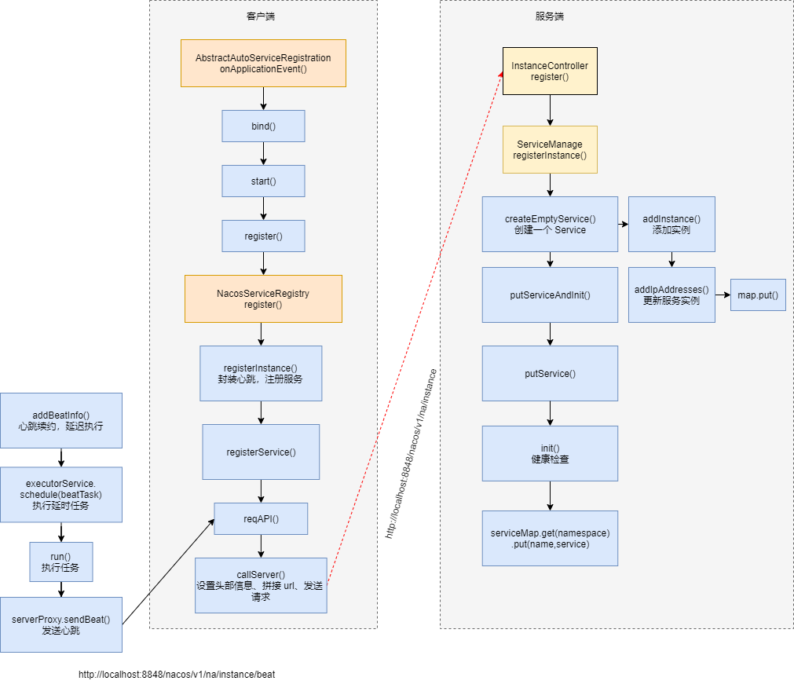

# Nacos服务注册

### 客户端服务注册

Spring Cloud 可以使用的服务发现组件有很多，为了使用这些第三方组件，Spring Cloud 提供了一组接口，第三方只要遵循这个接口规范就可以在 Spring Cloud 中使用了。

首先是服务注册接口，在进行服务注册时统一会调用接口中的方法进行注册

```java
public interface ServiceRegistry<R extends Registration> {
    // 注册实例
    void register(R registration);
    // 取消注册
    void deregister(R registration);
    // 关闭注册（生命周期方法）
    void close();
    // 设置注册状态
    void setStatus(R registration, String status);
    // 获取注册状态
    <T> T getStatus(R registration);
}
```

服务注册之后，需要对服务中心进行管理，Spring Cloud 提供了 `DiscoveryClient` 接口，来对服务进行管理。

```java
public interface DiscoveryClient extends Ordered {
    int DEFAULT_ORDER = 0;
    String description();

    // 返回与特定实例ID相关联的实例
    List<ServiceInstance> getInstances(String serviceId);

    // 返回服务实例 ID
    List<String> getServices();

    @Override
    default int getOrder() {
        return DEFAULT_ORDER;
    }
}
```

在调用服务注册方法之前，需要发现服务。Spring Cloud 也制定了一个接口 `AutoServiceRegistration`，来统一服务发现的管理，而具体如何进行服务发现，就交给各个第三方组件来实现。

`AutoServiceRegistration` 是一个接口，里面没有定义任何属性和方法。其实现类 `AbstractAutoServiceRegistraation` 定义了一系列生命周期方法。

```java
/**
 * Lifecycle methods that may be useful and common to {@link ServiceRegistry}
 * implementations.
 */
public abstract class AbstractAutoServiceRegistration<R extends Registration>
        implements AutoServiceRegistration, ApplicationContextAware,
        ApplicationListener<WebServerInitializedEvent> {
    // 用于服务注册
    private final ServiceRegistry<R> serviceRegistry;

    public void onApplicationEvent(WebServerInitializedEvent event) {
        bind(event);
    }
}
```

`AbstractAutoServiceRegistraation` 还实现了 `ApplicationListener` 接口，该接口会监听 Spring Boot 的启动，当 Spring Boot 启动时，会调用实现该接口的监听器的 `onApplicationEvent` 方法，而在 `AbstractAutoServiceRegistraation#onApplicationEvent` 调用了 `bind()` 方法，在 `bind()` 中有调用了 `start()` 方法，在 `start()` 方法中调用了 `register()` 方法。`register()` 方法是由成员变量 `serviceRegistry#register()` 实现的。所以服务发现的逻辑可以定位到第三方组件的 `register()` 方法中。

```java
public void bind(WebServerInitializedEvent event) {
    ApplicationContext context = event.getApplicationContext();
    this.port.compareAndSet(0, event.getWebServer().getPort());
    this.start();
}

public void start() {
    if (!this.running.get()) {
        this.context.publishEvent(
                new InstancePreRegisteredEvent(this, getRegistration()));
        register();
        if (shouldRegisterManagement()) {
            registerManagement();
        }
        this.context.publishEvent(
                new InstanceRegisteredEvent<>(this, getConfiguration()));
        this.running.compareAndSet(false, true);
    }
}    

protected void register() {
    super.register();
}

protected void register() {
    this.serviceRegistry.register(getRegistration());
}
```

由于我们研究的是 Nacos，所以我们来到 `ServiceRegistry` 的实现类 `NacosServiceRegistry` 中

```java
public void register(Registration registration) {

    String serviceId = registration.getServiceId();

    Instance instance = new Instance();
    // 一系列setter 方法设置实例信息...

    namingService.registerInstance(serviceId, instance);
}
```

`register` 方法很简单，new 了一个 Instance，然后设置了 IP、端口、权重等信息，调用 `registerInstance` 进行注册。

```java
public void registerInstance(String serviceName, String groupName, Instance instance) throws NacosException {

    if (instance.isEphemeral()) {
        BeatInfo beatInfo = new BeatInfo();
        // 一系列setter 方法，设置心跳信息......
        beatReactor.addBeatInfo(NamingUtils.getGroupedName(serviceName, groupName), beatInfo);
    }

    serverProxy.registerService(NamingUtils.getGroupedName(serviceName, groupName), groupName, instance);
}

public void registerService(String serviceName, String groupName, Instance instance) throws NacosException {
    final Map<String, String> params = new HashMap<String, String>(8);
    // 将 instance 中的信息封装到 params 中...

    reqAPI(UtilAndComs.NACOS_URL_INSTANCE, params, HttpMethod.POST);
}
```

在 `registerService` 方法中，从 Instance 实例中提取出各种信息，封装到心跳信息和一个 params 参数 map 中。器中 params map 作为 `reqAPI` 方法的参数传入。`reqAPI` 方法的主要作用就是发送一个 HTTP 请求，用于请求 Nacos 服务器，用于注册该服务。

```java
public String reqAPI(String api, Map<String, String> params, List<String> servers, String method) {

    params.put(CommonParams.NAMESPACE_ID, getNamespaceId());

    if (servers != null && !servers.isEmpty()) {
        Random random = new Random(System.currentTimeMillis());
        int index = random.nextInt(servers.size());

        for (int i = 0; i < servers.size(); i++) {
            String server = servers.get(index);
            return callServer(api, params, server, method);
            index = (index + 1) % servers.size();
        }
    }
}

public String callServer(String api, Map<String, String> params, String curServer, String method)
    throws NacosException {
    // 设置头部信息
    List<String> headers = builderHeaders();

    // 拼接 url，最后得到的 url 形如：http://localhost:8848/nacos/v1/ns/instance
    String url;
    if (!curServer.contains(UtilAndComs.SERVER_ADDR_IP_SPLITER)) {
        curServer = curServer + UtilAndComs.SERVER_ADDR_IP_SPLITER + serverPort;
    }
    url = HttpClient.getPrefix() + curServer + api;
    // 发送 http post 请求，请求注册服务
    HttpClient.HttpResult result = HttpClient.request(url, headers, params, 
}
```

### 服务端注册

在 `callServer` 方法中会发送一个 post 请求到服务端，url 形如 : [http://localhost:8848/nacos/v1/ns/instance。所以服务端肯定有一个](http://localhost:8848/nacos/v1/ns/instance。所以服务端肯定有一个) Controller 用于接收请求。这个 Controller 就是 `InstanceController`。发送了请求之后会调用 `InstanceController#register` 进行服务端的注册

```java
@CanDistro
@PostMapping
public String register(HttpServletRequest request) throws Exception {

    String serviceName = WebUtils.required(request, CommonParams.SERVICE_NAME);
    String namespaceId = WebUtils.optional(request, CommonParams.NAMESPACE_ID, Constants.DEFAULT_NAMESPACE_ID);

    serviceManager.registerInstance(namespaceId, serviceName, parseInstance(request));
    return "ok";
}

public void registerInstance(String namespaceId, String serviceName, Instance instance) throws NacosException {
    // 创建服务
    createEmptyService(namespaceId, serviceName, instance.isEphemeral());

    Service service = getService(namespaceId, serviceName);

    addInstance(namespaceId, serviceName, instance.isEphemeral(), instance);
}
```

在 `register` 方法中调用了 `registerInstance` 方法，先创建了一个服务，然后添加服务。创建服务的具体代码如下：

```java
public void createServiceIfAbsent(String namespaceId, String serviceName, boolean local, Cluster cluster) throws NacosException {
    Service service = getService(namespaceId, serviceName);
    if (service == null) {

        Loggers.SRV_LOG.info("creating empty service {}:{}", namespaceId, serviceName);
        service = new Service();
        // setter 设置服务信息...
        service.validate();

        putServiceAndInit(service);
        if (!local) {
            addOrReplaceService(service);
        }
    }
}

  private void putServiceAndInit(Service service) throws NacosException {
    putService(service);
    // 初始化，定时发送心跳，并设置 service
    service.init();
    consistencyService.listen(KeyBuilder.buildInstanceListKey(service.getNamespaceId(), service.getName(), true), service);
    consistencyService.listen(KeyBuilder.buildInstanceListKey(service.getNamespaceId(), service.getName(), false), service);
} 

public void putService(Service service) {
    // 检查 serviceMap 是否已经注册了该 service
    if (!serviceMap.containsKey(service.getNamespaceId())) {
        synchronized (putServiceLock) {
            if (!serviceMap.containsKey(service.getNamespaceId())) {
                serviceMap.put(service.getNamespaceId(), new ConcurrentHashMap<>(16));
            }
        }
    }
    // 注册服务
    serviceMap.get(service.getNamespaceId()).put(service.getName(), service);
}
```

可以看到注册逻辑也很简单，就是创建了一个 Service 实例，封装了服务信息后，直接放入到了一个 map 中。



